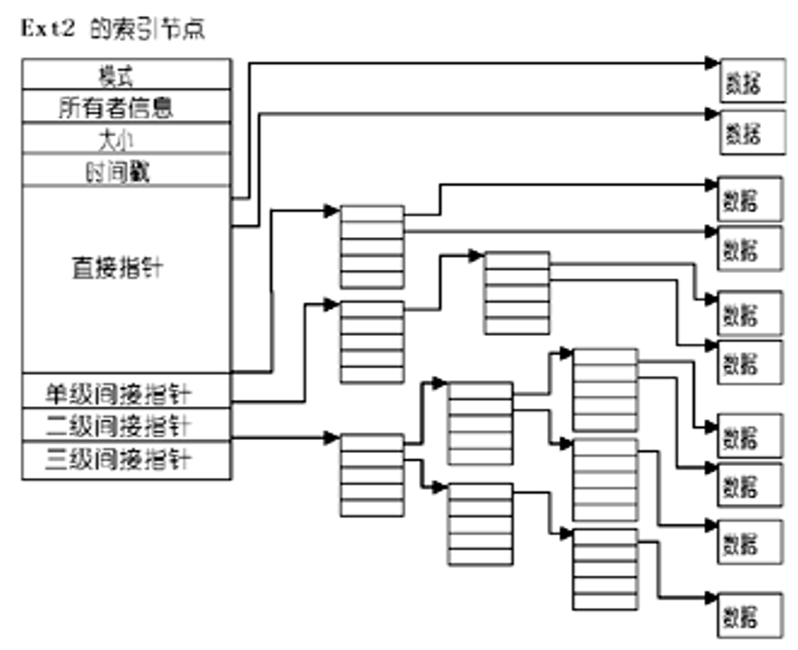

Exam0-往年试题
---

# 1. 填空题/选择题
1. 【2014】umask设定为022，则默认新建文件的权限是(644)
   1. 文件的权限是666-umask
   2. 目录的权限是777-umask
   3. 2是write、4是read，1是执行
2. 【2014】Linux中可以调用文件操作分(系统调用函数)和C库函数
3. 【2014】将文件按页打印的命令是(more)
4. 【2014】chmod的功能是(修改文件权限)
5. 【2014】Linux中文件描述符的数据类型是(非负整数)
6. 【2015】用户和内核的接口是(系统调用)
7. 【2015】删除文件夹的命令是什么(rm-rf)
8. 【2015】重定向-输出文件内容(>)
9. 【2015】切换用户的命令(su username)
10. 【2017】索引结点：文件的管理信息(名字和一些属性)，包括文件的创建/修改日期和它的访问权限，被保存在文件的inode中，它是文件系统中的一个特殊的数据块，它同时还包含文件的长度和文件在磁盘上的存放位置。系统使用的是文件的inode号，目录结构为文件命名仅仅是为了便于使用。



11. 【2017】几个特殊符号
   1. SIGHUP连接挂断
   2. SIGINT终端中断
   3. SIGKILL终止进程（此信号不能被捕获或忽略）
   4. SIGQUIT终端退出
   5. SIGTERM终止
   6. SIGCHLD子进程已经停止或退出
   7. SIGCONT继续执行暂停进程
   8. SIGSTOP停止执行（此信号不能被捕获或忽略）
   9. SIGTSTP终端挂起
12. 【2017】I/O库函数三种缓存(全缓存、行缓存、不带缓存)
13. 【2017】大多数UNIX系统都提供了(mmap机制或存储映射I/O)，可以在不使用read/write的情况下执行I/O


# 2. 简答题
1. 【2014】Linux中的文件描述符和文件指针FILE *的区别什么？(9')
   1. 文件描述符：在Linux系统中打开文件就会获得文件描述符，它是很小的正整数。每个进程在PCB(Process Control Block)中保存着一份文件描述表，文件描述符就是这个文件描述符的索引，每个表项都有一个指向已打开文件的指针。
   2. 文件指针：C语言中使用文件指针作为I/O的句柄，文件指针指向进程用户区中的一个被称为FILE结构的数据结构。FILE结果包括一个缓冲区和一个文件描述符。而文件描述符是文件描述符表的一个索引，因此从某种意义上文件指针就是句柄的句柄
2. 【2014】什么是操作系统内核？请简要叙述操作系统内核的主要功能。
   1. 操作系统是一系列程序的集合，其中最重要的部分构成了内核。
   2. 内核分为单内核和微内核两种
      1. 单内核是一个很大的部分，内部可以划分为若干模块，运行时是一个独立的二进制文件，模块间通讯通过直接调用函数实现。
      2. 微内核中大部分内核作为独立的进程在特权下运行，通过消息传递进行通讯。
3. 【2014】【2015】比较软链接和硬链接的不同之处(至少三点)，并分别给出硬链接和软链接在命令行和应用程序代码中的创建方法。(15')
   1. 硬链接：
      1. 不同的文件名对应同一个inode号
      2. 不能跨越文件系统
      3. 对应系统调用link
   2. 软链接：
      1. 存储被链接文件的文件名(而不是inode)实现链接
      2. 可跨越文件系统
      3. 对应系统调用symlink
   3. shell：
      1. 软链接:`ln -s [filename] [filename]`
      2. 硬链接:`ls [filename] [filename]`
   4. 应用程序：

```c
// 创建硬链接
#include <unistd.h>
int link(const char *oldpath, const char *newpath);
// (Return: 0 if success; -1 if failure)
```
```c
// 创建软链接：
#include <unistd.h>
int symlink(const char *oldpath, const char *newpath);
// (Return: 0 if success; -1 if failure)
```

4. 【2014】Linux设备中字符设备与块设备有什么主要的区别？请分别列举一些实际的设备说出它是哪一类设备(9')
   1. 字符设备：提供连续的数据流，应用程序可以顺序读取，通常不支持随机存取。相反，此类设备支持按字节/字符来读写数据。距离来说，调制调节器是典型的字符设备。
   2. 块设备：应用程序可以随机访问设备数据，程序可自行确定读取数据的位置。硬盘是典型的块设备，应用程序可以寻址磁盘上的任何位置，并由此读取数据。此外，数据的读写只能以块(通常是512B)的倍数进行。与字符设备不同，块设备不支持基于字符的寻址。
5. 【2015】为什么Linux引入makefile？和其他脚本的区别？使用makefile编译系统有哪些特点？
6. 【2017】编写两个简单的程序（fred.c, bill.c），将其编译为目标文件，并分别生成静态库和动态库。再编写程序调用之，说明库的使用。
   1. 生成静态链接库
      1. `gcc -c h.c -o h.o`
      2. `ar cqs libh.a h.o`：ar是生成库的命令，cqs是参数，libh.a是生成的静态链接库须以lib开头，h是库名，a表示是静态链接库，h.o是刚生成的目标文件
   2. 生成动态链接库
      1. `gcc -c h.c -o h.o`
      2. `gcc -shared -WI -o libh.so h.o`：生成动态链接库使用gcc来完成，-shared -WI是参数，libh.so是刚生成的静态链接库，必须以lib开头，h是库名，so表示动态链接库，h.o是刚生成目标文件。
   3. 将生成的libh.a，libh.so拷贝到/usr/lib或/lib下
   4. 编译带静态链接库的程序
      1. `gcc -c test.c -o test.o`
      2. `gcc test.o -o test -WI -Bstatic -lh`:-WI -Bstatic表示链接静态库，-lh中-l表示链接，h是库名即/usr/lib下的libh.a
   5. 编译带动态链接库的程序
      1. `gcc -c test.c -o test.o
      2. `gcc test.o -o test -WI -Bdynamic -lh`:-WI -Bdynamic表示链接动态库，-lh中-l表示链接，h是库名即/usr/lib下的libh.so
   6. 运行./test得到结果
7. 【2017】什么是shell内部命令；试距离说明，并说明该命令为什么是内部命令
   1. bash命令解释套装程序包含了一些内部命令，这些内部命令在目录列表无法看到，而是由shell本身提供。
   2. bash的内部命令：alias、bg、fg、builtin、break、exit、let、kill、export、hash、jobs、set、umask、test、type、ulimit。可以man bash，然后搜索"SHELL BULTIN COMMANDS"即可查看内部命令
      1. echo：在屏幕上显示出子串
      2. eval：当遇到eval语句时，shell读入参数args，并将它们组合成一个新的命令后执行。
      3. exec：不创建子进程，而是去执行指定的命令，当指定的命令执行完时，该进程就终止，所以shell程序中exec后面的语句都不再执行。
      4. export：可以将变量向下代入子shell中，从而让子进程继承父进程中的环境变量。但是子shell不能使用export反向代入到父进程。
      5. readonly：将一个用户定义的shell变量标识为不可变。不含任何参数的readonly命令将显示出所有只读的shell变量。
      6. read：从标准输入设备读入一行，分解成若干字，复制给shell程序内部定义的变量
      7. shift：将所有的参数位置左移一个位置。
      8. wait：使得shell等待在后天启动的所有子进程结束，wait的返回值总是为真。
      9. exit：退出shell程序，在exit之后可以指定一个数作为返回状态。
      10. .：使shell读入指定的shell程序文件并依次执行文件中的所有语句。
8. 【2017】用户没有对/etc/passwd和/etc/shadow的写权限，为什么可以通过passwd命令修改口令
   1. 实际用户和有效用户
   2. passwd程序的有效用户是root，有权限修改权限
9.  【2017】open系统调用的四种模式分别有什么效果
   1.  P84
   2.  O_RDONLY以只读方式打开
   3.  O_WRONLY以只写方式打开
   4.  O_RDWR以读写方式打开
10. 【2017】以I/O为例，说明系统调用接口与库接口的异同
    1. 
    2. 从程序完成的功能来看，函数库提供的函数通常是不需要操作系统的服务. 函数是在用户空间内执行的，除非函数涉及到I/O操作等，一般是不会切到核心态的。系统调用是要求操作系统为用户提供进程，提供某种服务，通常是涉及系统的硬件资源和一些敏感的软件资源等。
    3. 函数库的函数，尤其与输入输出相关的函数，大多必须通过Linux的系统调用来完成。因此我们可以将函数库的函数当成应用程序设计人员与系统调用程序之间的一个中间层，通过这个中间层，我们可以用一致的接口来安全的调用系统调用。这样程序员可以只要写一次代码就能够在不同版本的linux系统间使用积压种具体实现完全不同的系统调用。至于如何实现对不同的系统调用的兼容性问题，那是函数库开发者所关心的问题。
    4. 从程序执行效率来看，系统调用的执行效率大多要比函数高，尤其是处理输入输出的函数。当处理的数据量比较小时，函数库的函数执行效率可能比较好，因为函数库的作法是将要处理的数据先存入缓冲区内，等到缓冲区装满了，再将数据一次写入或者读出。这种方式处理小量数据时效率比较高，但是在进行系统调用时，因为用户进程从用户模式进入系统核心模式，中间涉及了许多额外的任务的切换工作，这些操作称为上下文切换，此类的额外工作会影响系统的执行效率。但是当要处理的数据量比较大时，例如当输入输出的数据量超过文件系统定义的尺寸时，利用系统调用可获得较高的效率。
    5. 从程序的可移植性的角度来看，相对于系统调用，C语言的标准备函数库（ANSI C）具备较高的可移植性，在不同的系统环境下，只要做很少的修改，通常情况是不需要修改的。
    6. 库函数是高层的，完全运行在用户空间，为程序员提供调用真正的在幕后完成实际事务的系统调用的更方便的接口。系统调用在内核态运行并且由内核自己提供。标准C库函数printf()可以被看做是一个通用的输出语句，但它实际做的是将数据转化为符合格式的字符串并且调用系统调用write()输出这些字符串。


11. 【2017】说明编写一个client_server程序可以使用哪些IPC机制(3种)，并对其性能、效率、使用方法、易用性进行述评。
   1. 信号：
      1. 信号机制是UNIX为进程中断处理而设置的。它只是一组预定义的值，因此不能用于信息交换，仅用于进程中断控制。例如发生浮点错、非法内存访问、执行无效指令、某些按键等都会产生一个信号，操作系统就会调用有关的系统调用或用户定义的处理过程来处理。
      2. 系统调用:signal，调用形式是signal(signalno, action)
      3. signalno是规定信号编号的值，action指明当特定的信号发生时所执行的动作。
   2. 管道：
      1. 管道是用于**具有亲缘关系进程间的通信**，有名管道克服了管道没有名字的限制，因此，除具有管道所具有的功能外，它还允许无亲缘关系进程间的通信。
      2. 管道机制在**本机上的两个进程间的数据传递表现的相当出色**。
      3. 分类：通过内核缓冲区按先进先出的方式数据传输，管道一端顺序地写入数据，另一端顺序地读入数据。读写的位置都是自动增加，数据只读一次，之后就被释放。在缓冲区写满时，则由相应的规则控制读写进程进入等待队列，当空的缓冲区有写入数据或满的缓冲区有数据读出时，就唤醒等待队列中的写进程继续读写。管道对数据采用先进先出方式管理，并严格按顺序操作，例如不能对管道进行搜索，管道中的信息只能读一次。
         1. pipe：无名管道
            1. 实际上是内存中的一个临时存储区，由系统安全控制，并且独立于创建它的进程的内存区。
            2. 无名管道只能用于两个相互协作的进程之间的通信，并且访问无名管道的进程必须有共同的祖先。
            3. 系统提供了许多标准管道库函数
               1. pipe()——打开一个可以读写的管道
               2. close()——关闭相应的管道
               3. read()——从管道中读取字符
               4. write()——向管道中写入字符
         2. FIFO：命名管道，使用有名管道的进程不需要具有共同的祖先，其它进程，只要知道该管道的名字，就可以访问它。管道非常适合进程之间快速交换信息。
      4. 管道的局限性：
         1. 只支持单向数据流
         2. 只能用于具有亲缘关系的进程之间
         3. 没有名字
         4. 管道的缓冲区是有限的(管道存在内存中，管道创建时，为缓冲区分配一个页面大小。)
         5. 管道所传送的是无格式字节流，要求管道的读出方和读入方必须实现约定好数据的格式。
   3. 信号量：主要作为进程间以及同一进程不同线程之间的同步手段
      1.  在UNIX中，信号量是一组进程共享的数据结构，当几个进程竞争同一资源时（文件、共享内存或消息队列等），它们的操作便由信号量来同步，以防止互相干扰。
      2.  信号量保证了某一时刻只有一个进程访问某一临界资源，所有请求该资源的其它进程都将被挂起，一旦该资源得到释放，系统才允许其它进程访问该资源。信号量通常配对使用，以便实现资源的加锁和解锁。
      3.  进程间通信的实现技术的特点是：操作系统提供实现机制和编程接口，由用户在程序中实现，保证进程间可以进行快速的信息交换和大量数据的共享。但是，上述方式主要适合在同一台计算机系统内部的进程之间的通信。
   4. 共享内存：使得多个进程可以访问同一块内存，是最快的可用IPC形式
      1. 是针对其他通信机制运行效率较低而设计的。往往与其它通信机制，如信号量结合使用，来达到进程间的同步及互斥。
      2. 共享存储段是主存的一部分，它由一个或多个独立的进程共享。各进程的数据段与共享存储段相关联，对每个进程来说，共享存储段有不同的虚拟地址。系统提供的有关SM的系统调用有：
         1. `int shmget(key, size, flag)` 创建大小为size的SM段，其相应的数据结构名为key，并返回共享内存区的标识符shmid
         2. `char shmat(shmid, address, flag)` 将当前进行数据段的地址赋给shmget所返回的名为shmid的SM段。
         3. `int shmdr(address)` 从进程地址空间删除SM段
         4. `int shmctl(shmid, cmd, buf)` 对SM的控制操作
         5. **SM的大小只受主存限制**，SM段的访问及进程间的信息交换可以通过同步读写来完成。同步通常由信号灯来实现。**SM非常适合进程之间的大量数据的共享**。
   5. 消息队列：
      1. 消息队列是消息的链接表，包括Posix消息队列system V消息队列。有足够权限的进程可以向队列中添加消息，被赋予读权限的进程则可以读走队列中的消息。**消息队列克服了信号承载信息量少，管道只能承载无格式字节流以及缓冲区大小受限等缺点**
      2. 消息队列是内存中独立于生成它的进程的一段存储区，一旦创建消息队列，任何进程，只要具有正确的的访问权限，都可以访问消息队列，**消息队列非常适合于在进程间交换短信息**。
         1. 消息队列的每条消息由类型编号来分类，这样**接收进程可以选择读取特定的消息类型**——这一点与管道不同。消息队列在创建后将一直存在，直到使用msgctl系统调用或iqcrm -q命令删除它为止。
         2. 系统提供了许多有关创建、使用和管理消息队列的系统调用，如：
            1. `int msgget(key,flag)` 创建一个具有flag权限的MQ及其相应的结构，并返回一个唯一的正整数msqid（MQ的标识符）
            2. `int msgsnd(msqid,msgp,msgsz,msgtyp,flag)` 向队列中发送信息
            3. `int msgrcv(msqid,cmd,buf)` 从队列中接收信息
            4. `int msgctl(msqid,cmd,buf)` 对MQ的控制操作
   6. 套接字
      1. **更为一般的进程间通信机制，可用于不同机器之间的进程间通信**。
      2. 起初是由Unix系统的BSD分支开发出来的，但现在一般可以移植到其它类Unix系统上：Linux和System V的变种都支持套接字。
12. 【2018】请介绍你关注的Linux发行版有哪些特点？
13. 【2018】VFS的四部分对象和分别的用途？
14. 【2018】简述至少四种文件锁，并写出系统调用，并说说其功能

# 3. 论述编程题
1. 【2014】重定向是Linux中的重要机制。请描述Linux重定向的用途、使用方法、典型案例，并简要描述其实现机制(15')
   1. 使用方法：Linux中可以使用shell的重定向符号
      1. `>`为输出重定向
      2. `<`为输入重定向
      3. 例子
         1. 将标准输出流重定向到1.txt：`echo "linux" >1.txt`
         2. 将标准输入流重定向到1.txt：`cat<1.txt`
   2. 实现机制：主要通过使用dup2系统调用通过明确指定目标描述符来把一个文件描述符复制为另一个。

```c
// 实现标准输出的重定向，printf打印的字符写入4.txt文件
int fd=-1;
char buffer[100];
int len=0;
fd=open("4.txt",O_CREAT|O_RDWR);
dup2(fd,STDOUT_FILENO);
printf("hello world");
close(fd);
```

2. 【2018】重定向有哪几种？详细介绍每种的功能？
3. 【2014】使用C的库函数，编写一个函数`void bindiff(char *file1, char *file2, char *fileo)`，将文件从file1、file2对应的路径读取并逐字节比对，将相同的字节删除到fileo对应的文件。(25')

```c++
#include<stdio.h>
void bindiff(char *file1, char *file2, char *fileo);
int main()
{
	bindiff("1.txt","2.txt","3.txt");
}
void bindiff(char *file1, char *file2, char *fileo)
{
	FILE * fp1 = 0,*fp2=0,*fpo=0;
	char ch1,  ch2;
	fp1 = fopen(file1,"r");
	fp2 = fopen(file2,"r");
	fpo = fopen(fileo,"w");
	while (1)
	{
		ch1 = (char)fgetc(fp1);
		ch2 = (char)fgetc(fp2);
		if (feof(fp1) || feof(fp2))
		{
			break;
		}
		if (ch1 == ch2)
		{
			fputc(ch2,fpo);
		}
	}
	fclose(fp1);
	fclose(fp2);
	fclose(fpo);
}
```

3. 【2015】看代码，是否有缓冲区溢出？如何改进？
4. 【2015】用系统调用实现输出给定文件夹中所有文件的名字 用空格隔开，并在文件夹及文本文件的输出后注上"（文件夹）"、"（文本文件）"
5. shell脚本编程
   1. 【2015】获得用户输入的100个整数，并输出其最大值，最小值，总和。
   2. 【2017】查看当前目录下的子目录并且只显示子目录
      1. `ls -F | grep /$`
      2. `ls -l | grep "^d"`
   3. 【2017】查找一个错误代码EPERM(宏定义)在Linux系统头文件中的定义并显示:`grep ERERM *.h`
6. 【2017】创建一个包含两个进程的进程环，其中每一个进程的标准输出是另一个进程的标准输入（画图说明，可以用伪代码，但要写出关键的系统调用函数）。
   1. 父进程创建两个pipe，然后fork，父子进程再关闭一些fd，就会产生一个环
   2. pipe、fork
7. 【2017】一段简单的并发网络端程序，填空并说明作用；说出两种实现并发服务器的方式。
   1. 课本P536
   2. 并发服务器在套接字最后一节"多客户"有介绍
8. 【2017】说明shell中管道的实现机制(可以使用伪代码，但是要写出关键的系统调用函数)
   1. pipe管道机制和dup系统调用, fork
   2. CH4 P81 P84
9.  【2018】描述命令的功能：
   3. who
   4. comm -12
   5. comm -13
   6. comm -23
   7. sleep
   8. 管道
   9. 重定向
10. 【2018】使用系统调用实现函数half(a, b)将a文件的一般拷贝到b文件，且b仅包含a文件的后一半的内容

 
 