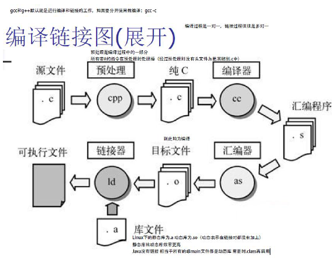
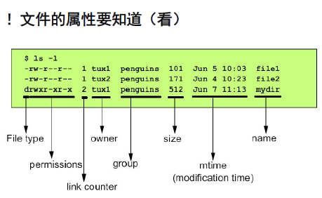
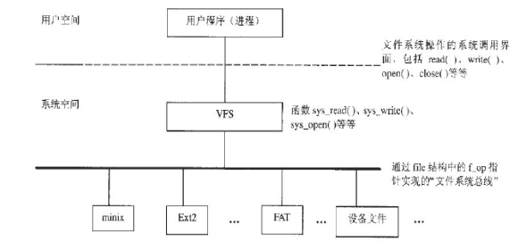
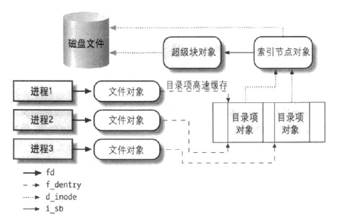

Exam1-重点
---
# 1. 第一章：Linux Basic

## 1.1. Linux 基础
1. Linux 是什么样的系统：Linux是使用C编译器、C依赖库、emacs和bash开发的。
2. Linux 创始人：Linus Torvalds
3. Linux 发行版：Red Hat(后来发展为Fedora)、Debain(一定要配置自由软件，不会配置商业软件)、Ubuntu(用户好用就行)、SuSe、Mandrake、Redflag

## 1.2. Linux 安装过程
1. 安装过程：选择语言、键鼠 -> 磁盘分区 -> 设置引导加载程序 -> 配置网络 -> 配置用户和认证 -> 选择包装组 -> 配置 -> 安装软件包 -> 创建启动盘
2. 分区的基本知识
   1. 最多只能有四个主分区；主分区可以是扩展分区；一个扩展分区可能有很多逻辑分区。
   2. MBR硬盘分区
      1. 磁盘分区 不能超过4T
      2. 扩展分区 扩展分区不能直接使用，还需要划分为逻辑分区，额外分区是指向正确的额外分区表
      3. 逻辑分区
3. MBR：Master Boot Record：主引导记录
   1. 磁盘的0磁道的第1个扇区称为MBR，共512字节，由BIOS定位
   2. 内容
      1. 446 bytes 引导代码 Boot Loader
      2. 64 bytes 磁盘分区表，最多4个条目
      3. 2 bytes的magic number(0x55AA)
4. GPT(GUID Partition Table) Globally Unique Identifier Partition Table
   1. 新的硬件必须有新的代码与其对应
   2. 不要在老的机器上装新的分区组织方式
   3. GPT是MBR不够用了才会选择使用

## 1.3. Linux 引导加载程序
1. 引导加载程序加载并启动Linux内核：传递启动参数(设备信息)、选择加载初始根磁盘、启动其他操作系统。
2. 通用引导加载程序：LILO(Linux加载程序)、GRUB(Grand Unified Boot Loader)
3. 除非使用其他引导加载程序，否则通常在/dev/hda中进行配置

## 1.4. Linux 启动过程
1. 打开电源 -> BIOS -> boot loader -> Linux kernel -> init -> System Ready
2. BIOS：检查存储，从非易失存储中加载参数(内存时序、启动设备顺序)、检查引导设备(软盘、CD-ROM、磁盘等)、装载引导设备的MBR(包含"Boot Loader"和分区表，通常是有LILO/GRUB来启动)并执行
3. 初始化进程
   1. 使用/etc/inittab的配置文件
   2. 按照启动级别启动

## 1.5. Linux 软件安装
1. 开源软件源代码操作

```sh
tar -zxvf code.tar.gz
cd code
./configure
make # 编译
su - # 切入root权限
make install
```

2. 自动安装：
   1. apt-get command *
      1. update 获取到最新的软件包
      2. upgrade 升级已安装的所有软件包
   2. dpkg：debian/Ubuntu、手动一个一个安装
   3. aptitude
   4. yum + rpm
   5. rpm：RPM打包管理
      1. rpm -q -a
      2. rpm –ivh package-name
      3. rpm –e package-name

## 1.6. 命令行和图形界面各有什么好处？

# 2. Shell Programming

## 2.1. Shell是什么
1. Shell是用户与操作系统的接口，作为核外程序存在。具有双重角色：
   1. Shell是一种命令解释程序：Linux的开发启动过程(进程树)、Shell的工作步骤：打印提示符；得到命令行；解析命令；查找文件；准备参数；执行命令。
   2. Shell还是一种独立的程序设计语言解释器。
2. Shell脚本的执行方式
   1. 方法1：`sh script_file`，Shell新建进程运行本方法
   2. 方法2：`chmod +x script_file`授予文件可执行权限；`./script_file`，Shell新建进程运行
   1. 方法3：`source script_file`；`.script_file`，Shell使用本进程运行
3. 不同类型的Shell


4. shell和虚拟终端是不同的，一台电脑只有一个console，但是可以划分很多虚拟终端，虚拟中断是从console模拟出来的。
   1. `VT 1-6`文本模式登陆
   2. `VT 7`图形模式登陆提示
   3. 可以使用Alt-Fn在VT之间切换

## 2.2. 基本命令
- `passwd`：修改密码
- `mkpasswd`：生成随机密码
- `date`：当天日期
- `cat`：展示一个日历
- `who`：查看用户名以及当前登录名
- `whoami`：查看用户名
- `finger`：当前用户的home目录
- `clear`：清空当前屏幕
- `echo`：写一个信息到屏幕；-n 不换行
- `write`：为已经登录的用户发送一个消息
- `wall`：群发消息
- `talk`：希望进行对象
- `mesg`：用来设置是否允许向当前终端写消息(Y/N)
- `cd`：切换文件夹
- `mkdir`：创建文件夹
  - `-m` 设置权限(-m 777)
  - `-p` 一次性创建多个路径
  - `-v` 每次创建新目录都显示信息
- `rmdir`：删除文件夹
- `ls`：查看信息：`-l` 查看所有信息；`-a` 查看包含隐藏文件；`-R` 递归的查看所有文件信息；格式为`文件类别、权限(3种)、链接数(硬链接数)、拥有者、拥有者组、大小、最后修改时间、名称`
- `touch`：更新权限或修改文件权限
  - `-a` 更改File变量指定的文件的访问时间，不更新修改时间
  - `-c` 如果文件不存在，则不要进行创建
  - `-f` 强制touch运行，不需要管理文件的读和写许可权
  - `-m` 更改FILE的修改时间，不要更改访问时间。
- `cp`：拷贝文件
- `mv`：移动或重命名文件
- `ln`：链接文件
- `rm`：删除文件
- `cat`：打印文件内容
- `more`：显示文件内容，向下滚动
- `less`：显示文件内容，上下滚动
- `ps`：报告所有的进程状态
- `pstree`：展示树状的程序们
- `jobs`：用于显示Linux中的任务列表及任务状态，包括后台运行的任务；显示任务号及其对应的进程号。
- `fg`：将一个进程移动到前台执行
- `bg`：将一个进程移动到后台执行
- `<ctrl-Z>`：停止某一个任务
- `kill`：杀死一个进程
- `nohup`：忽略挂起的信号
- `nice`：以更改过的优先级运行进程
- `renice`：重新指定一个或多个进程的优先级
- `top`：查看当前的CPU信息状态
- `mknod`: 在/dev下创建驱动的设备文件
- `mkfifo`：创建管道文件
- `chmod`：修改文件权限
  - `who`：u，g，o，a
  - `Operator`：+，-，==
  - `what`：r(4)，w(2)，x(1)
- `chown`：修改文件所有者
- `chgrp`：修改文件分组
- `find`：查找(find dir [-name] "*.c")
  1. options
    1. -depth 在查看目录本身之前，先搜索目录的内容
    2. -follow 跟随符号链接
    3. -maxdepths N 最多搜索N层目录
    4. -mount/-xdev 不搜索其他文件系统中的目录
  2. tests
    1. -name 根据名字查找
    2. -type 根据文件类型查找
    3. -user 根据用户名查找
    4. -ctime 根据最近更新时间查询
    5. -atime N 文件在N天之前被最后访问过
    6. -mtime N 文件在N天之前被最后修改过
    7. -newer other_file 文件比other_file新
- `ar`：用于建立或修改备存文件(创建静态链接库)，或是从备存文件中抽取文件。
- `tar`：
  1. 解压：tar -xzvf test.tar.gz  
  2. 压缩：tar -zcvf test.tar.gz ./test/
- `head`：查看文件头部，默认10行
- `tail`：查看文件尾部，默认10行
- `su`：切换用户名
- `uname`：打印当前Linux的版本信息
- `man`：查看命令说明书
- `grep`：在文件中搜索字符串

## 2.3. 重定向 掌握
1. 标准输入、标准输出、标准错误
   1. 对应的文件描述符：0、1、2
   2. C语言变量：stdin、stdout、stderr
2. 符号
   1. `<`：输入重定向，改变命令的输入，后面指定输入内容(文件名)
   2. `>`：输出重定向，将前面输出的部分输入到后面的文件，并清空文件内容。
   3. `>!`：同上，强制覆盖。
   4. `<<`：追加输入重定向：后面跟字符串，用来表示输入结束
   5. `>>`：追加输出重定向：把前面输出的东西追加到后面的文件尾部，不清除文件的内容
   6. `2>`：错误重定向：将错误的信息输入到后面的文件中，会删除文件原有的内容
   7. `2>>`：错误追加重定向：将错误的信息追加到后面的文件中，不会删除文件原有的内容
3. 重定向操作在底层本质上就是调用了`dup2`函数，将进程的文件描述符进行拷贝和覆盖
4. 一般情况下，每个Unix/Linux命令运行时都会打开三个文件：
   1. 标准输入文件(stdin)：stdin的文件描述符为0，Unix程序默认从stdin读取数据。
   2. 标准输出文件(stdout)：stdout的文件描述符为1，Unix程序默认向stdout输出数据。
   3. 标准错误文件(stderr)：stderr的文件描述符为2，Unix程序会向stderr流中写入错误信息。
5. 如果希望将stdout和stderr合并后重定向到file，可以这样写：command > file 2 >& 1或command >> file 2>&1，为什么需要将标准错误重定向到标准输出的原因，那就归结为标准错误没有缓冲区，而stdout有。
6. 如果希望对stdin和stdout都重定向，可以这样写：command < file1 > file2；command命令将stdin重定向到file1，将stdout重定向到file2。

## 2.4. 管道 掌握
1. 将一个进程的输出作为另一个进程的输入
2. 上一个操作的标注输出指的是上一个命令在一系列重定向操作之后的仍然会输出到stdout的文件描述符

## 2.5. 环境变量 掌握
1. 变量包括 用户变量、环境变量、参数变量和内部变量
2. 操作环境的参数
3. 查看和设置环境变量
   1. `echo $file_parameters`
   2. `env` 查看所有环境变量
   3. `set` 查看所有环境变量
4. 例：PATH环境变量，对变量进行读操作添加`$`，而写操作不必
   1. `echo $PATH`
   2. `export PATH`：设置和显示环境变量
5. 具体变量
   1. `HOME` 用户登录目录
   2. `PATH` 问号分割的用来搜索命令的目录清单
   3. `PS1` 命令行提示符，通常是$字符
   4. `PS2` 辅助提示符，用来提示后续输入，通常是>字符
   5. `IFS` 输入区分隔符
   6. `UID` 当前用户的识别字，取值由数位构成的字串
   7. `PWD` 当前工作目录的绝对路径名
6. 参数变量和内部变量(未提)
   1. `$#` 传递到脚本程序的参数个数
   2. `$0` 脚本程序的名字
   3. `$1, 2...` 脚本程序的参数
   4. `$*` 全体参数组成的清单，使用IFS中的第一个字符分割
   5. `$@` `$*`的变体，不使用IFS中的第一个字符分割

## 2.6. 正则表达式 简单掌握
1. `^`指向任何一行的开头
2. `$`指向一行的结尾
3. `.`任意单个字符
4. `[]`包括
5. `?`匹配0或1次
6. `*`匹配0次或多次
7. `+`匹配一次或多次
8. `{n}`匹配n次
9. `{n,}`匹配n次或n次以上
10. `{n,m}`匹配n次到m次

## 2.7. Read、单引号、双引号、转义符
1. `Read`
   1. `read var`会等待从控制台获得输入放在`$var`中，要是直接read则会把输入的值放在`$REPLY`
      1. `-p "str"` 先输出提示符
      2. `-t 5` 5s内输入
      3. `-s` 不显示输入
      4. `-a` 将分裂后的字段依次存储到指定的数组中，存储的起始位置从数组的index=0开始。
      5. `-d` 指定读取行的结束符号。默认结束符号为换行符。
      6. `-n` 限制读取N个字符就自动结束读取，如果没有读满N个字符就按下回车或遇到换行符，则也会结束读取。
      7. `-N` 严格要求读满N个字符才自动结束读取，即使中途按下了回车或遇到了换行符也不结束。其中换行符或回车算一个字符。
      8. `-r` 禁止反斜线的转义功能。这意味着"\"会变成文本的一部分。
2. 单引号：所有字符都保持本身字符的意思，而不会被bash进行解释
3. 双引号：除了`$`、`''`和`\`以外，双引号内的所有字符将保持字符本身的函数而不被bash解释(打印上面的特殊字符需要配合转义符号)
4. 转义符
5. echo直接加内容会解析所有，如果后面的内容有空格，会当做两个参数-用双引号引起来

## 2.8. 简单操作

### 2.8.1. 字符串操作
1. `str1 = str2` 字符串相同则结果真
2. `str1 != str2` 字符串不先沟通则结果为真
3. `-z str` 字符串为空则结果为真
4. `-n str` 字符串不为空则结果为真

### 2.8.2. 文件操作
1. `-e file` 文件存在则结果为真
2. `-d file` 文件是一个子目录则结果为真
3. `-f file` 文件是一个普通文件则结果为真
4. `-s file` 文件的长度不为零则结果为真
5. `-r file` 文件可读则结果为真
6. `-w file` 文件可写则结果为真
7. `-x file` 文件可执行则结果为真

### 2.8.3. 逻辑操作
1. `! expr` 逻辑表达式求反
2. `expr1 -a expr2` 逻辑表达式 and
3. `expr1 -o expr2` 逻辑表达式 or

### 2.8.4. 算术操作
1. `expr1 –eq expr2` 两个表达式相等则结果为真
2. `expr1 –ne expr2` 两个表达式不等则结果为真
3. `expr1 –gt expr2` expr1大于expr2则结果为真
4. `expr1 –ge expr2` expr1大于或等于expr2则结果为真
5. `expr1 –lt expr2` expr1小于expr2则结果为真
6. `expr1 –le expr2 expr1` 小于或等于expr2则结果为真

## 2.9. Shell编程

### 2.9.1. if语句
1. if语句的条件判断是使用test命令获得的[ expression ]，expression是前半个括号的参数
2. Shell中0表示为真，expression为0经过then

```sh
if [ expression ]
then
   statements
elif [expression]
then
   statements
else
   statements
fi
```

2. 紧凑模式：使用;分割

### 2.9.2. case语句
```sh
case str in
   str1 | str2) statements;;
   str3 | str4) statements;;
   *) statements;;
esac
```

### 2.9.3. for语句
```sh
for var in list
do
   statements
done

for((i=1;i<5;i++))
do
   statements
done
```

### 2.9.4. while语句
```sh
while condition
do
   statements
done
```

### 2.9.5. until语句
```sh
until condition
do
   statements
done
```

### 2.9.6. select语句
1. Select后面输入的是数字，对应item list
```sh
select item in itemlist
do
   statements
done
```

### 2.9.7. 命令组合
1. 分号串联:`command1;command2;...`
2. 条件组合
   1. AND命令表:`statement1 && statement2 && ...`
   2. OR命令表:`statement1 || statement2 || ...`

### 2.9.8. 函数：相当于另一个命令
```sh
# 函数要求理解即可，不必会写
func(){
   local var # 在函数内部定义的变量默认是全局变量
   statements
   return xxx
}
func para1 para2 # 函数内部调用$1 $2 得不到脚本参数，而是调用函数时后面的参数
```

### 2.9.9. 杂项命令
- `break` 跳出循环
- `continue` 调到下一个循环继续
- `exit n` 以退出码n退出
- `return` 函数返回
- `export` 将变量导出到shell成为环境变量
- `set` 设置环境变量
- `unset` 删除环境变量
- `trap` 收到收到操作系统信号后执行的动作
- `:` 冒号命令：空命令
- `.` 句号命令或source：在当前shell中执行命令，而不新启动进程

### 2.9.10. 捕获命令输出
1. 语法
   1. `$(command)`：执行command并将结果作为字符串放在这里
   2. `command`
2. 算术扩展：`$(($x+1))`
3. 参数扩展：
   1. `${param=default}`：如果param不存在，则返回default，并将它设置为default的值
   2. `${param:=default}`：如果param不存在或值为空，做如上操作
   3. `${#param}`：给出param的长度
   4. `${var_name-default}`，如果var_name不存在，则返回default的值
   5. `${var_name:-default}`，如果var_name不存在或者值为空，则返回default的值
   6. `${var_name+default}`，如果var_name存在，则返回default的值
   7. `${var_name:+default}`，如果var_name存在且不为空，则返回default的值
   8.  `${var_name?default}`，如果var_name不存在，则报错并输出default的值
   9.  `${var_name:?default}`，如果var_name不存在或者值为空，则报错并default的值
   10. `${param%word}`：从param的尾部开始删除与word匹配的最小部分，然后返回剩余部分
   11. `${param%%word}`：从param的尾部开始删除与word匹配的最长部分，然后返回剩余部分
   12. `${param#word}`：从param的头部开始删除与word匹配的最小部分，然后返回剩余部分
   13. `${param##word}`：从param的头部开始删除与word匹配的最长部分，然后返回剩余部分
   14. `${var_name:x:y}`，提取var_name的值
          1. 如果x
             1. 是非负数：从左侧开始第x个字节开始
             2. 是负数：
          2. 如果y
             1. 是非负数：的连续y个字节的内容
             2. 是负数：到从右侧开始数y个字节的内容
   15. `${var_name/regex/sub}`，替换var_name中的内容，语法和sed及vim的替换指令一样，只替换一次
   16. `${var_name/regex/sub}`，替换var_name中的内容，语法和sed及vim的替换指令一样，替换全部

## 2.10. 即时文档
1. `cat >> file.txt << !CATINPUT!`

# 3. Linux Programming Persuite

## 3.1. gcc命令
1. Usage:
   1. gcc [options] [filename]
2. gcc 链接(如果文件为.o，则自动只做链接，生成可执行文件) 或 编译+链接
   1. `-E`：只对源程序进行预处理(调用cpp预处理器)
   2. `-S`：只对源程序进行预处理、编译
   3. `-c`：执行预处理、编译、汇编而不连接
   4. `-o`：output_file：输出执行文件名
   5. `-g`：产生调试工具所必须的符号信息
   6. `-O/On`：在程序编译、连接过程中进行优化处理
   7. `-Wall`：显示所有的警告信息
   8. `-ldir`：指定额外的**头文件**搜索路径，dir是文件路径
   9. `-Ldir`：指定额外的**库文件**搜索路径，dir是文件路径
   10. `-lname`：链接时搜索指定的库文件
   11. `-DMACRO[=DEFN]`：定义MACRO宏，比如`gcc -DAA=2`相当于源码中添加了#define AA 2
3. g++ C++对应命令

```sh
gcc –o hello hello.c ： 将hello.c文件编译成hello的可执行文件
gcc –c hello.c ： 将hello.c文件生成hello.o文件 gcc -E hello.c ： 只是激活预处理，不生成文档，需要把它重定向到另外一个文档里
gcc –S hello.c ： 将hello.c文件生成hello.s文件的汇编代码
gcc –pipe –o hello hello.c ： 使用管道代替编译中临时文档
gcc hello.c –include /root/hello.h ：包含某个代码，简单来说，就是以某个文档，需要另外一个文档的时候，就能够用它设定，功能就相当于在代码中使
```

## 3.2. gdb
1. `file` 打开要调试的文件
2. `break/tbreak` 设置调试
3. `run` 执行当前调试的程序
4. `list` 列出源代码一部分
5. `next` 执行一步但不进入函数
6. `step` 执行一步进入函数
7. `display` 显示表达式的值
8. `print` 临时显示表达式的值
9. `kill` 中止调试
10. `quit` 退出

## 3.3. 编译链接图


1. 每一个源代码和目标文件是一一对应的
2. 链接器是将所有的目标文件进行连接
3. 打包后得到了.a静态库文件

## 3.4. 静态库和动态库
1. 二者的不同点在于代码被载入的时刻不同。
   1. 静态库的代码在编译过程中已经被载入可执行程序，因此体积比较大。
   2. 动态库(共享库)的代码在可执行程序运行时才载入内存，在编译过程中仅简单的引用，因此代码体积比较小。
   3. 不同的应用程序如果调用相同的库，那么在内存中只需要有一份该动态库(共享库)的实例。
   4. 静态库和动态库的最大区别：静态情况下，把库直接加载到程序中，而动态库链接的时候，它只是保留接口，将动态库与程序代码独立，这样就可以提高代码的可复用度，和降低程序的耦合度。
2. 静态库：编译链接时，把库文件的代码全部加入可执行文件中，因此生成的文件比较大，但是运行时也就不需要库文件了，后缀名一般为`.a`
   1. 为什么需要静态库：通过静态库的方式降低复杂度，在升级更新时尽量做到增量更新，但是静态库会导致复用性降低，磁盘占用高。
3. 动态库：在编译链接时并没有把库文件的代码加入可执行文件中，而是在程序执行时由运行时链接文件加载库，这样可以节省系统的开销，后缀名一般为`.so`。
   1. 动态库的作用
      1. 库文件不在可执行文件中，放置在外侧
      2. 升级更新会方便快捷
      3. 动态库会存在冲突(版本问题)
4. gcc/g++在编译时默认使用动态库。无论静态库还是动态库，都是由.o文件构成的

## 3.5. Makefile
1. Makefile描述模块间的依赖关系，会记录所有文件的信息，在make时决定链接时需要重新编译哪些
2. 如果找到，它会找文件中的第一个目标文件(target)
3. 如果文件不存在，或后依赖的.o文件的修改时间新于这个文件，那么则会执行后面所定义的命令来生成这个文件。

### 3.5.1. make
1. 命令根据Makefile对程序进行管理和维护
2. make命令格式:`make [-f Makefile][option][target]`
3. make判断被维护文件的时序关系
4. make install 需要root权限

### 3.5.2. makefile语法
1. 缩进
   1. 顶格的为规则
   2. 缩进的为命令
2. makefile语法
   1. target是一个目标文件
   2. prerequisites是生成target所需的文件或目标
   3. command是make需要执行的命令
   4. 默认回显：如果不想要回显则在命令前添加@
   5. "%.o"表明要所有以".o"结尾的目标，即"foo.o bar.o"，就是变量$object集合的模式

```makefile
target: prerequisites
   command
```

3. 举例：依赖关系，如果后面的文件更新，则执行如下代码，若输出文件不存在是执行如下代码则为违反规则。

```makefile
hello : main.o kbd.o
  gcc -o hello main.o kbd.o
main.o : main.c defs.h
  cc -c main.c
kbd.o : kbd.c defs.h command.h
  cc -c kbd.c
clean :
  rm edit main.o kbd.o # 伪目标
```

### 3.5.3. 伪目标
```makefile
clean:
   rm *.o hello
```

1. 伪目标并不是一个文件，只是一个标签，所以make无法生成器依赖关系和决定它是否要执行，只能显式的指明目标才能使其生效。
2. 伪目标取名不能和文件名重名：可以使用`.PHONY`标记来显示地指明一个目标是伪目标，向make说明，不管是否有这个文件，这个目标是伪目标
3. 伪目标一般无依赖文件，但是也可以执行
4. 伪目标可以作为默认目标，只要放到第一个

### 3.5.4. makefile例子
```makefile
TOPDIR = ../
include $(TOPDIR)Rules.mak
EXTRA LIBS += :
EXEC = $(INSTALL_DIR)/hello
# make时会找到makefile文件，找到其中的第一个目标文件，如果不存在或旧的，则会执行后面命令来生成hello文件
OBJS = hello.o # make uninstall之后系统中源代码仍然存在
# 变量定义，makefile可以include别的makefile

all: $(EXEC) # 默认执行make all
  $(EXEC): $(OBJS)
  $(CC) $(LDFLAGS) -0 $@ $(OBJS) $(EXTRA_LIBS) # gcc的别名CC，$@明确了目标文件放置位置
install:
  $(EXP_INSTALL) $(EXEC) $(INSTALL_ DIR) # make install执行的指定目标
clean:
  -rm -f $(EXEC) *.elf*.gdb *.o
```

### 3.5.5. 预定义变量
1. `$<` 第一个依赖文件的名称
2. `$?` 所有的依赖文件，以空格分开，这些依赖文件的修改日期比目标的创建日期晚
3. `$+` 所有的依赖文件，以空格分开，并以出现的先后为序，可能包含重复的依赖文件
4. `$^` 所有的依赖文件，以空格分开，不包含重复的依赖文件
5. `$*` 不包括扩展名的目标文件名称
6. `$@` 目标的完整名称
7. `$%` 如果目标是归档成员，则该变量表示目标的归档成员名称

# 4. Linux System Programmming - File System

## 4.1. 文件和文件系统
1. 文件：是数据的集合，可以写入、读取或两者兼有的对象(文件具有某些属性，包括访问权限和类型)。逻辑上是字节，文件必然是整数字节。
2. 文件结构：字节流(Linux)、记录序列、记录树
3. 文件系统：操作系统中负责访问和管理文件的部分，是文件及其某种属性的集合，为引用文件的文件序列号提供了名称空间。
   1. 一种特定的文件格式
   2. 指按指定格式进行格式化的一块存储介质
   3. 指操作系统中(通常内核中)用来管理文件系统以及对文件进行操作的机制及其实现

### 4.1.1. 文件类型：七种
1. `-` 普通文件：文件或代码数据，没有特别的内部结构
2. `d` 目录
3. `l` 符号链接
4. `s` 套接字文件(网络接口):启动一个程序来监听客户端的要求，而客户端可以通过这个socket来进行数据的沟通
5. `b` 块设备文件：发大量数据，比如移动硬盘，字符设备按块读取
6. `c` 字符设备文件：发少量数据，按字符读取
7. `p` 命名管道文件：结果多个程序同时存取一个文件的错误问题

### 4.1.2. 文件夹结构
1. `/boot`：内核、bootloader的配置，包括引导加载程序相关的文件
2. `/etc`：系统的配置文件所在地(包含下载的软件的配置)
3. `/bin`：程序文件夹，包含二进制可执行文件，例如`ls`，其实是在执行一个程序，也有一部分程序在`/usr/bin`(在我的linux上，/bin是/usr/bin的软链接)
5. `/sbin`：系统二进制文件，但是这个目录下的Linux命令通常**由系统管理员使用，对系统进行维护**，例如`ifconfig/fdisk`也有部分程序在`/sbin`，例如分区命令`fdisk`
6. `/mnt`：**挂载目录**，临时挂载目录，系统管理员可以挂载文件系统。
7. `/usr`：资源文件夹(和编程相关的)；编译器、默认的头文件、系统中的库文件，包含二进制文件、库文件、文档和二级程序的源代码
   1. `/usr/bin`中包含用户程序的二进制文件。
   2. `/usr/sbin`中包含系统管理员的二进制文件。
   3. `/usr/lib`中包含了`/usr/bin`和`/usr/sbin`用到的库。
   4. `/usr/local`中包含了从源安装的用户程序。
8. `/lib`：系统库。包含**支持位于/bin和/sbin下的二进制文件的库文件**；库文件名为 `ld*或lib*.so.*`
9. `/proc`：包括**系统进行相关信息**。这是一个虚拟的文件系统，包含有关正在运行的进程的信息；系统资源以文本信息形式存在。
10. `/var`：系统里的可变数据，**变量文件**，并不是存放在磁盘上的数据，一般是存放在内存中的数据。
    1. 系统日志文件 `/var/log`
    2. 包和数据库文件 `/var/lib`
    3. 电子邮件 `/var/mail`
    4. 打印队列 `/var/spool`
    5. 锁文件 `/var/lock`
    6. 多次重新启动需要的临时文件 `/var/tmp`
11. `/dev`：包含**设备文件**，这些包括终端设备、USB或连接到系统的任何设备。例如`/dev/tty1`
12. `/tmp`：包含系统和用户创建的**临时文件**，当系统重新启动时，这个目录下的文件都将被删除。
13. `/home`：用home目录来存储他们的个人档案。
14. `/opt`：可选的附加应用程序
15. `/media`：用于挂载**可移动设备**的临时目录。举例来说，挂载CD-ROM的/media/cdrom，挂载软盘驱动器的/media/floppy
15. `/srv`：srv代表服务。包含服务器特定服务相关的数据。
16. 修改环境变量PATH，临时修改可以直接`PATH=$PATH:/bin`，但是要永久生效得修改配置文件`/etc/profile`

### 4.1.3. 文件的属性


## 4.2. 文件权限
1. 文件权限要求掌握，SUID、SGID等权限
   1. sticky：在这个文件夹创建的文件是否具有用户互斥性，比如在一个文件夹中是否允许user1写入的文件被user2删除
   2. SUID：将用户提升到root权限，经典：su
   3. SGID：将组提升到root，经典：sudo
2. 文件权限层次
   1. 用户：创建文件的用户
   2. 组：拥有文件的组中的所有用户
   3. 其他用户：其他
3. 三个类型
   1. 读 r 读取文件内容或列表内容目录
   2. 写 w 更改文件内容或创建/删除文件在目录中
   3. 执行 x 以程序执行文件或使用目录作为活动目录

## 4.3. VFS

### 4.3.1. 什么是VFS
1. 采用标准的Unix系统调用读写位于不同物理介质上的不同文件系统，使得open()等系统调用不用关心底层的存储介质和文件类型
2. VFS：Virtual File System Switch

|  |  |
| -------------------- | -------------------- |

### 4.3.2. VFS在系统内建立的四种结构体和含义
1. 超级块(super block)：某一个磁盘的某一个分区的文件系统的信息，记录了文件系统类型和参数。
2. i-node 对象(i-node object)：记录真正的文件，文件存储在磁盘上时是按照索引号访问文件的，软链接是不同的文件，但是硬链接是相同的inode号，同一个文件。
3. 文件对象(file object)：记录了文件描述符、索引号，不对应真正的文件，文件打开会创建出文件对象，文件关闭才会释放内核中的文件对象。记录了文件的读写状态。
4. 目录对象(dentry object)：维护了目录中的逻辑关系，若要通过目录来查找文件，都需要这个对象。在路径上，无论是目录还是文件，都是一个dentry对象对应到目录包含的i-node上，目录项包括索引节点编号，目录项名称长度以及名称。

## 4.4. 硬链接和软链接 掌握
1. 硬链接
   1. 不同的文件名对应同一个inode
   2. 不能跨越文件系统
   3. 对应系统调用link
   4. ln -s [原文件名] [连接文件名]
2. 软链接
   1. 存储被链接文件的文件名(而不是inode)实现链接
   2. 可以跨越文件系统
   3. 对应系统调用symlink
   4. ln [原文件名] [连接文件名]

## 4.5. 系统调用和C库区别
1. 都以C库函数的形式出现
2. 系统调用：需要切换到内核态来进行相应的操作，编译运行速度和效率高，是Linux内核对外的位移接口(用户程序和内核之间的唯一接口)，提供出最小接口。
3. 库函数：库函数的可移植性好，依赖于系统调用，提供较为复杂的功能，例如标准I/O库

### 4.5.1. 系统调用
1. 文件描述符：一个非负整数
2. 文件操作的一般步骤：打开-读/写-寻道-关闭

```c++
int main(){
   int fd, nread;
   char buf[1024];

   fd = open("data", O_RDONLY);
   nread = read(fd, buf, 1024);
   close(fd);
}
```

### 4.5.2. 文件系统调用函数

#### 4.5.2.1. 头文件`<unistd.h>`
1. int open(const char *pathname, int flags); 
2. int open(const char *pathname, int flags, mode_t mode);
3. int creat(const char *pathname, mode_t mode); (Return: a new file descriptor if success; -1 if failure)
   1. flags
      1. O_RDONLY：只读
      2. O_WRONLY：只写
      3. O_RDWR：读写
      4. O_APPEND：追加模式打开
      5. O_TRUNC：覆盖模式
      6. O_CREAT：文件不存在则创建
      7. O_EXCL：和O_CREAT同时使用，存在时出错
      8. O_NONBLOCK：非阻塞
   2. mode
      1. S_IRUSR
      2. S_IWUSR
      3. S_IXUSR
      4. S_IRWXU
      5. S_IRGRP
      6. S_IWGRP
      7. S_IXGRP
      8. S_IRWXG
      9. S_IROTH
      10. S_IWOTH
      11. S_IXOTH
      12. S_IRWXO
4. int close(int fd) 关闭文件描述符，释放资源
5. size_t read(int fd, void *buf, size_t count) 返回值为读到的字节数，如果已经到文件尾为0，若出错为-1
6. size_t write(int fd, const void *buf, size_t count) 返回值为已经成功写的字节数，若出错为-1
   1. STDIN_FIFENO(0) 标准输入
   2. STDOUT_FIFENO(1) 标准输出
   3. STDERR_FIFENO(2) 标准错误
7. off_t lseek(int fildes, off_t offset, int whence)：如果成功返回偏移地址，否则为-1
    1. SEEK_SET：从头偏移offset
    2. SEEK_CUR：从当前偏移offset
    3. SEEK_END：从尾偏移offset
8. int dup(int oldfd) 提供一种复制文件描述符的方法，我们可以用两个或多个描述符来访问同一个文件。作用:复制文件描述符。dup产生一个相同的文件描述符指向同一个文件: 
    1.  `fd2 = dup(STDOUT_FILENO)` 保存标准输出
9. int dup2(int oldfd, int newfd) 如果成功返回一个文件描述符。dup2复制一个旧的文件描述符到新的文件描述符，使得新的文件描述符与旧的文件描述符完全一样，过程主要是先关闭新的文件描述符对应的文件，然后进行复制
10. int link(const char* oldpath, const char* newpath) 创建文件的一个新连接
11. int unlink(const char *pathname)删除文件名和可能的引用文件
12. int symlink(const char *pathname, const char *newpath)创建一个符号链接
13. int readlink(const char *path, char *buf, size_t bufsiz) 从符号链接中读取值
14. int access(const char* pathname, int mode) 按实际用户ID和实际组ID测试文件的存取权限，mode为R_OK，W_OK，X_OK，F_OK(文件是否存在)
15. int chown(const char *path, uid_t owner, gid_t group)
16. int fchown(int fd, uid_t owner, gid_t group)
17. int lchown(const char *path, uid_t owner, gid_t group)
18. char *getcwd(char *buf, size_t size) 获取绝对路径

#### 4.5.2.2. 头文件`<sys/types.h>`

#### 4.5.2.3. 头文件`<fcntl.h>`
1. int fcntl(int fd, int cmd);
2. int fcntl(int fd, int cmd, long arg);
3. int fcntl(int fd, int cmd, struct flock *lock);返回值；若成功则依赖于cmd，若出错则为-1
   1. F_DUPDF：复制文件描述符
   2. F_GETFD/F_SETFD：获取/设置文件描述符标志，为解决fork子进程执行其他任务(exec等)导致父进程的文件描述符被复制到子进程中，使得对应文件描述符无法被之后需要的进程获取。设置了这个标记后可以使得子进程在执行exce等命令后释放对应的文件描述符资源。
   3. F_GETFL/F_SETFL:获得/设置文件状态标志(open/creat中的flags 参数)，目前只能更改0_APPEND , 0_ASYNC, 0_DIRECT, 0_NOATIME,O_NONBLOCK
   4. F_GETOWN/F_SETOWN: 管理1/0可用相关的信号。获得或设置当前文件描述符会接受SIGI0和SIGURG信号的进程或进程组编号F_GETLK/F_SETLK/F_SETLKW: 获得/设置文件锁,设置为F_GETLK时需要传入flock* 指针用于存放最后的锁信息。S_SETLK 需要传入flock *指针表示需要改变的锁的内容,如果不能被设置,则立即返回EAGAIN。
   5. s_SETLKW同s_SETLK，但是在锁无法设置时会阻塞等待任务完成。

#### 4.5.2.4. 头文件`<sys/stat.h>`
1. `int stat(const char *filename, struct stat *buf); `
   1. 把对应文件名的相关信息存到对应地址里
   2. filename 文件名
   3. 遇到文件软链接的时候得到的属性是软链接文件的属性
2. `int fstat(int filedes, struct stat *buf);`
   1. 把对应文件描述符的相关信息存储到对应地址
   2. fstat系统调用的接受的是一个文件描述符，而其他接受的是文件全路径。
3. `int lstat(const char *file_ name, struct stat *buf);Return: 0 if success; -1 if failure)`
   1. 当文件是一个符号链接时，lstat返回的是符号链接本身的信息，而stat返回的是指向的文件的信息。
4. `int chmod(const char *path, mode_t mode)`
5. `int fchmod(int fildes, mode_t mode)`
6. `mode_t umask(mode_t mask)`为进程设置文件存取权限屏蔽字，并返回以前的值
   1. mask进程默认八进制022，文件最终权限是mode & ~ mask的结果
7. int mkdir(const char *pathname, mode_t mode);
8. int rmdir(const char *pathname)
9. int chdir(const char *path) 改变工作目录
10. int fchdir(int fd); 改变工作目录

#### 4.5.2.5. 头文件`<dirent.h>`
1. DIR * opendir(const char *name);
2. int closedir(DIR *dir);
3. struct dirent* readdir(DIR *dir);
4. off_t telldir(DIR *dir);
5. void seekdir(DIR *dir, off_t offset);
6. 相关结构体略


```c++
struct stat {
   mode_t   st_mode;    /*file type & mode 低9位保存权限信息，之后为sticky、SGID、SUID，[12:17]保存了文件类型*/
   ino_t    st_ino;     /*inode number (serial number)*/
   dev_t    st_rdev;    /*device number (ile system)*/，
   nlink_t  st_nlink;   /*link count 硬链接计数 */
   uid_t    st_uid;     /*user ID of owner*/
   gid_t    st_gid;     /*group ID of owner*/
   off_t    st_size;    /*size of file, in bytes*/
   time_t   st_atime;   /*time of last access*/
   time_t   st_mtime;   /*time of last modification*/
   time_t   st_ctime;   /*time of last file status change*/
   long     st_blksize; /*Optimal block size for I/O*/
   long     st_blocks;  /*number 512-byte blocks allocated*/
}
```

## 4.6. 使用C编写重定向
```c++
savefd = dup(STDOUT_FILENO); // savefd指向终端
dup2(connfd, STDOUT_FILENO); // STDOUT_FIFENO(1)重新指向connfd
// 处理事情
dup2(savefd, STDOUT_FIFENO); // STDOUT_FIFENO(1)恢复指向savefd
```

## 4.7. 标准I/O依赖(C库)

### 4.7.1. 文件流
1. 流和FILE结构
   1. FILE* fp
   2. 预定义的指针：stdin，stdout，stderr
2. 缓冲I/O
   1. 三种类型的缓冲
      1. 全缓冲 全缓冲指的是系统在填满标准IO缓冲区之后才进行实际的IO操作；注意，对于驻留在磁盘上的文件来说通常是由标准IO库实施全缓冲。
      2. 行缓冲 在这种情况下，标准IO在输入和输出中遇到换行符时执行IO操作；注意，当流涉及终端的时候，通常使用的是行缓冲。
      3. 无缓冲 无缓冲指的是标准IO库不对字符进行缓冲存储；注意，标准出错流stderr通常是无缓冲的。

### 4.7.2. 流操作：头文件`#include <stdio.h>`
1. `FILE *fopen(const char * filename, const char* mode);`
   1. r 读
   2. w 清空写
   3. a 追加
   4. r+ 读写
   5. w+ 清空读写
   6. a+ 不清空读写
2. `int fclose(FILE *stream)`
3. `int getc(FILE *fp)`：是预定义宏，无函数副作用，更快
4. `int fgetc(FILE *fp)`：常用，在用到函数副作用/函数指针用
5. `int getchar(void)`：由stdin读取一个字节，默认行缓冲
6. 返回为char的int型
7. 三种函数
   1. `ferror`
   2. `feof`
   3. `clearerr`
8. `int putc(int c, FILE *fp)`
9. `int fputc(int c, FILE *fp)`
10. `int putchar(int c)`
11. `char *fgets(char *s, int size, FILE *stream)`常用，最多从流中读取并存储size-1个字符，并最后添加一个\0
12. `char *gets(char *s)`不常用
13. `int fputs(const char *s, FILE * stream);`
14. `int puts(const char *s);`
15. `size_t fread(void *ptr, size_t size, size_t nmemb, FILE *stream)` size 一次读取或写入的字节数 nmemb 读取或写入的字节数 stream 文件流
16. `size fwrite(const void *ptr, size_t size, size_t nmemb, FILE *stream);`，例如:`fwrite(&data[2], sizeof(float), 4, fp)!=4`
17. `int scanf(const char * format, ...)`
18. `int fscanf(FILE *stream, const char *format, ...)`
19. `int sscanf(const char * str, const char *format, ...)`
20. `int printf(const char *format, ...)`
21. `int fprintf(FILE *stream, const char *format, ...)`
22. `int sprintf(char * str, const char *format, ...)`
23. `int fseek(FILE *stream, long int offset, int whence)`，whence的取值：0是文件首、1是不跳转、2是文件尾向前。
24. `long ftell(FILE *stream)`当前位置到文件开头位置
25. `void rewind(FILE *stream)`跳到开头
26. `int fgetpos(FILE *fp, fpos_t *pos)`使用结构体解决文件太大，int不足的问题
27. `int fsetpos(FILE *fp, const fpos_t *pos)`
28. `int fflush(FILE *stream)`刷新文件流，将流里的数据立刻写入文件
29. `int fileno(FILE *fp)`确认流使用的底层文件描述符
30. `FILE *fdopen(int fildes, const char *mode)`根据已打开的文件描述符创建一个流
31. `char *tmpnam(char *s)`创建临时文件名，返回唯一路径名的指针
32. `FILE *tmpfile(void)`若成功为文件指针，若出错为NULL
33. `void setbuf(FILE *stream, char *buf)`：设置缓冲区
34. `void setvbuf(FILE *stream, char *buf, int mode, size_t size)`：设置缓冲区，mode缓冲区类型：_IOFBF 满缓冲，_IOLBF 行缓冲 _IONBF 无缓冲

## 4.8. 进程
1. 进程：是一个正在执行的程序实例，是操作系统的执行单位，由执行程序、当前值、状态信息以及通过操作系统管理此进程执行情况的资源组成；包含有一个地址空间，在该空间内指定一个或多个线程，并分配这些线程所需的系统资源。
2. `echi $$`告知shell当前的进程号
3. 进程的启动都由其他进程启动：所有的进程都是由内核进程(PID=1)来启动的，往往都具有父子进程关系，init(1号进程)由内核本身启动，形成树状的层次结构。
4. 进程的终止
   1. 正常终止
      1. 从main返回
      2. 调用exit函数(库函数，做清理处理)
      3. 调用_exit函数(系统函数，立即进入内核)
   2. 异常终止
      1. 调用abort函数
      2. 由一个信号终止
5. Daemons 守护进程：守护进程指的是一个永无止境的进程，通常是控制诸如打印机队列之类的系统资源或执行网络的系统进程。

## 4.9. 文件夹扫描程序
```c++
struct dirent {
   long d_ino;
   off_t d_off;
   unsigned short d_reclen;
   unsigned char d_type;
   char d_name [NAME_MAX + 1];
}

DIR *dp;
struct dirent * entry;
if((dp = opendir(dir)) == NULL)
   err_sys();
while((entry = readdir(dp)) != NULL){
   lstat(entry->d_name, &statbuf);
   if(S_ISDIR(statbuf.st_mode)){}
   else{}
}
closedir(dp);
```

## 4.10. 文件锁(掌握)
1. 文件锁要求掌握，扩展文件锁(共享强制锁等不用掌握)，锁的标记位不需要掌握，锁的系统调用需要掌握。

### 4.10.1. 文件锁记录
1. 记录锁：按记录加锁
2. 劝告锁：
   1. 检查，加锁有应用程序自己控制
   2. 不会强制应用程序不允许访问，只是提醒
3. 强制锁
   1. 检查，加锁由内核控制
   2. 影响 open() read() write()
4. 共享锁：可以读
5. 排它锁：读写均不可
6. 相关结构体

```c++
struct flock{
   short l_type;  /* Type of lock: F_RDLCK, F_WRLCK, F_UNLCK */
   short l_whence;/* How to interpret l_start: SEEK_SET, SEEK_CUR, SEEK_END */
   off_t l_start; /* Starting offset for lock */
   off_t l_len;   /* Number of bytes to lock */
   pid_t l_pid;   /* PID of process blocking our lock (F_GETLK only) */
}
```

### 4.10.2. fcntl记录锁
1. 用于记录锁的fcntl函数原型
2. `int fcntl(int fd, int cmd, struct flock *lock)`
3. cmd的取值
   1. F_GETLK：获得文件的封锁信息
   2. F_SETLK：对文件的某个区域封锁或解封
   3. F_SETLKW：功能和F_SETLK，wait方式相同

### 4.10.3. 其他封锁命令
1. 头文件:`#include<sys/file.h>`
2. `int lockf(int fd, int cmd, off_t len)`
   1. cmd：指定的操作类型
      1. F_LOCK：给文件夹互斥锁。若已被加锁则阻塞直到成功
      2. F_TLOCK：同上，但不会阻塞，直接失败
      3. F_ULOCK：解锁
      4. F_TEST：测试是否上锁。未上锁则0，否则-1
   2. len：从当前位置开始要锁住多长
   3. 这个函数是对fcntl的一层封装

# 5. 内核

## 5.1. 内核的概念
1. 操作系统是一系列程序的集合，其中最重要的部分构成了内核
2. 单内核/微内核
   1. 单内核是一个很大的进程，内部可以分为若干模块，运行时是一个独立的二进制文件，模块间通讯通过直接调用函数实现
   2. 微内核中大部分内核作为独立的进程在特权下运行，通过消息传递进行通
3. Linux内核的能力：内存管理，文件系统，进程管理，多线程支持，抢占式，多处理支持
4. Linux内核区别于其他UNIX商业内核的优点
   1. 单内核，模块支持
   2. 免费/开源
   3. 支持多种CPU，硬件支持能力非常强大
   4. Linux开发者都是非常出色的程序员.
   5. 通过学习Linux内核的源码可以了解现代操作系统的实现原理

## 5.2. 初始化程序的建立
1. initrd
   1. mkinitrd /boot/initrd.img $(uname -r)
2. initramfs
   1. mkinitramfs -o /boot/initrd.img 2.6.24-16
   2. update-initramfs -u

## 5.3. 模块.ko 掌握
1. 加载和释放模块的命令
   1. 底层命令
      1. `insmod <module.ko> [module parameters]`：装载一个模块，只有超级用户才可以使用
      1. `rmmod`：卸载一个模块
   2. 高层命令
      1. `modprobe`
      2. `modprobe -r`
2. 理解模块之间的依赖关系(比如模块A需要引用模块B所导出的符号)：自动按需加载、卸载
   1. `moddep`
   2. `lsmod`：列举所有在内核中装载的模块，等价于cat /proc/modules
   3. `modinfo`

## 5.4. 最简单的内核模块例子
```c++
#include <linux/kernel.h>
#include <linux/module.h>
#include <linux/init.h>
static int __init hello_init(void)
{
   // __init标记 该函数只在初始化期间使用。模块装载后，将函数占用的空间释放
   printk(KERN_INFO "Hello world\n");
   return 0;
}
static void __exit hello_exit(void)
{
   // __exit标记 该代码近用于模块卸载
   printk(KERN_INFO "Goodbye world\n");
}
module_init(hello_init);
module_exit(hello_exit);
```

## 5.5. 内核基本功能
内存管理，文件系统，进程管理，多线程支持，抢占式，多处理支持

## 5.6. 编译步骤
1. 解压
2. 清楚之前编译产生的目标文件:`make clean`
3. 配置内核:`make menuconfig`

## 5.7. 注意点
1. 不能使用C库开发驱动程序
2. 没有内存保护机制
3. 小内核栈
4. 并发考虑

## 5.8. 内核程序和用户态程序区别
| 用户态程序   | 内核态程序              |
| ------------ | ----------------------- |
| 用户空间运行 | 内核空间运行            |
| 入口是main() | 入口由module_init()指定 |
| 没有出口     | 出口由module_exit()指定 |
| 直接运行     | 程序由insmod命令载入    |
| gdb调试      | kdbug、kdb、kgdb等调试  |

## 5.9. 内核模块操作
1. 导出符号表
   1. `EXPORT_SYMBOL(name)`
   2. `EXPORT_SYMBOL_GPL(name)`
2. Moduls仅可以使用由Kernel或者其他Modules导出的符号，不能使用Libc
3. 显示所有导出符号:`cat /proc/kallsy`
4. 模块间参数传递
   1. 加载时传递:`insmod hello.ko test=2`
   2. 参数需要使用module_param宏声明:`module_param(变量名称，类型，访问许可掩码)`

## 5.10. 驱动设备
1. Linux系统将设备分为3种类型：
   1. 字符设备 Character Driver->字符型文件
   2. 块设备 Block Driver->块文件 
   3. 网络接口设备 Network Driver->Socket

### 5.10.1. 文件操作
```c++
ssize_t (*read) (struct file *, char __user *, size_t, loff_t *);
ssize_t (*write) (struct file *, const char __user *, size_t, loff_t *);
int (*flush) (struct file *);
Zint (*ioctl) (struct inode *, struct file *, unsigned int, unsigned long);

struct file_operations scull_fops = {
   .owner = THIS MODULE,
   .llseek = scull_llseek,
   .read = scull_read,
   .Write = scull_write,
   .ioctl = scull_ioctl,
   .open = scull_open,
   .release = scull_release,
};
```

### 5.10.2. 字符设备驱动程序的初始化加载过程
1. 申请设备号：每一个字符设备或块设备都有一个主设备号或次设备号
   1. 主设备号：表示一个特定的驱动程序
   2. 次设备号：表示使用该驱动程序的各设备
2. 定义文件操作结构体file_operations
3. 创建并初始化定义结构体cdev
   1. cdev结构体描述字符设备
   2. 该结构体是所有字符设备的抽象，其包含了大量字符设备所共有的特性。
4. 将cdev注册到系统，并和对应的设备号绑定
5. 在/dev文件系统中用mknod创建设备文件，并将该文件绑定到设备号上
   1. 设定设备号:`device=scull`
   2. 定义主设备号:`major=15`
   3. 用户可以通过访问`/dev/scull`来访问当前的驱动设备

### 5.10.3. 申请和释放设备号
```c++
int register_chrdev_region(dev_t first, unsigned int count, char *name);
int alloc_chrdev_region(dev_t *dev, unsigned int firstminor, unsigned int count, char *name);
void unregister_chrdev_region(dev_t first, unsigned int count);
```

### 5.10.4. cdev结构体的初始化
```c++
struct cdev *my_cdev = cdev_alloc();
my_cdev->ops = &my_fops;
void cdev_init(struct cdev *cdev, struct file_operations *fops);

struct scull_dev {
   struct scull qset *data; /* Pointer to first quantum set */
   int quantum; /* the current quantum size */
   int qset; /* the current array size */
   unsigned long size; /* amount of data stored here */
   unsigned int access_ key; /* used by sculluid and scullpriv */
   struct semaphore sem; /* mutual exclus ion semaphore */
   struct cdev cdev;/* Char device structure*/
};
```

### 5.10.5. 设备注册
1. 将设备注册到系统中：`int cdev_add(struct cdev *dev, dev_t num, unsigned int count);`
2. 释放一个已经注册的设备：`void cdev_del(struct cdev *dev);`

# 6. shell编程例子1

```sh
read mealCost
read tipPercent
read taxPercent
tip=`echo "$mealCost * $tipPercent / 100" | bc -1`
tax=`echo "$mealCost * $taxPercent / 100" | bc -1`
totalCost=`echo "$mealCost + $tip + $tax"| bc -1`
rCost=`printf "%. 0f" "$totalCost"`
echo "The total meal cost is $rCost dollars."
```

数值计算使用(())
