Lec1-Linux Basics
---

# 1. 什么是Linux
1. 根据GNU通用公共许可证开发的免费Unix类型的操作系统。
   1. 开源
   2. 受欢迎
   3. 支持大多数可用平台
2. GPL协议

## 1.1. Linux的简短历史
1. Multics：美国麻省理工学院，美国电话电报公司贝尔实验室
2. UNIX：1969年，肯·汤普森，丹尼斯·里奇
3. 使用C重写UNIX：1973
4. BSD：1978年，伯克利软件发行公司
5. System V：1983年
6. Minix(可以编译运行并且源代码量比较小的系统)：1987年，安德鲁·坦嫩鲍姆(Andrew Tannenbaum)
7. 商业产品：SunOS，Solaris，HP-UX，AIX，SCO UNIX
8. 标准：SVID，IEEE POSIX，X / Open XPG4.2

| 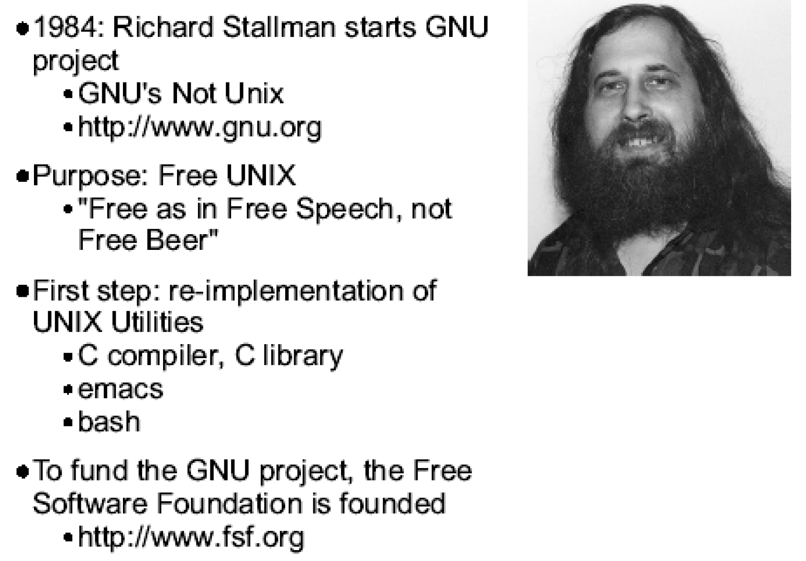 | 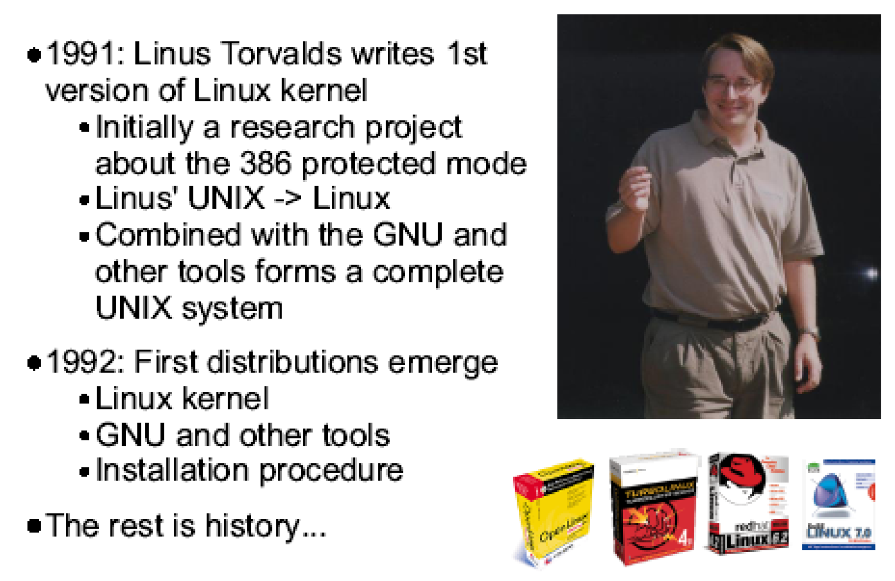 |
| ------------------- | ------------------- |

## 1.2. GNU和Linux
1. GNU/Linux系统
   1. Linux内核
   2. GNU软件/库
2. 分布：Red Hat, Debain, SuSe, Mandrake, Redflag

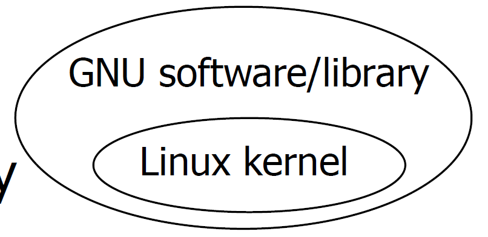

## 1.3. Linux有什么特殊地方？
1. 大多数软件(包括Linux内核)均为GPL版(GNU通用公共许可证)
2. 称为"copyleft"(而不是"copyright")
   1. 您可以复制软件
   2. 获得源代码
   3. 您可以更改源代码并重新编译
   4. 您可以分发更改后的源和二进制文件
   5. 您可能会为此付费
   6. 您只能更改许可证
3. 因此，所有客户都享有与您相同的权利
4. 因此，您真的无法通过出售单独的软件。
5. 其他开源许可证(例如BSD)也可用

## 1.4. 今天的Linux
1. Linux涵盖了整个计算领域
   1. 嵌入式设备
   2. 笔记本电脑
   3. 桌面系统
   4. 开发系统
   5. 小型和大型服务器
   6. 大型集群/超级计算机
2. Linux在世界范围内使用，甚至在太空
3. 家庭用户使用Linux，以及世界上一些最大的公司
   1. IBM
   2. 波音
   3. 美国宇航局

## 1.5. 安装方法
1. Distributions：
   1. Redhat -> Fedora
   2. Debian
   3. SuSe
   4. Mandrake
   5. Ubuntu
   6. ……
2. Live CD
3. Using virtual machine：VMware, Virtual Box, etc.

# 2. Linux安装
1. 从可启动媒体启动系统
2. 所有安装程序都需要执行基本相同的步骤：
   1. 选择语言，键盘类型，鼠标类型
   2. 创建分区**
   3. 设置引导加载程序**
   4. 配置网络
   5. 配置用户和认证
   6. 选择包装组
   7. 配置X
   8. 安装软件包
   9. 创建启动盘

## 2.1. 分区原理
1. 在基于Intel的计算机上必须进行分区
2. 最多四个主分区
3. 一个主分区可以是扩展分区
4. 扩展分区可以容纳无限数量的
5. 逻辑分区(Linux：最大59)

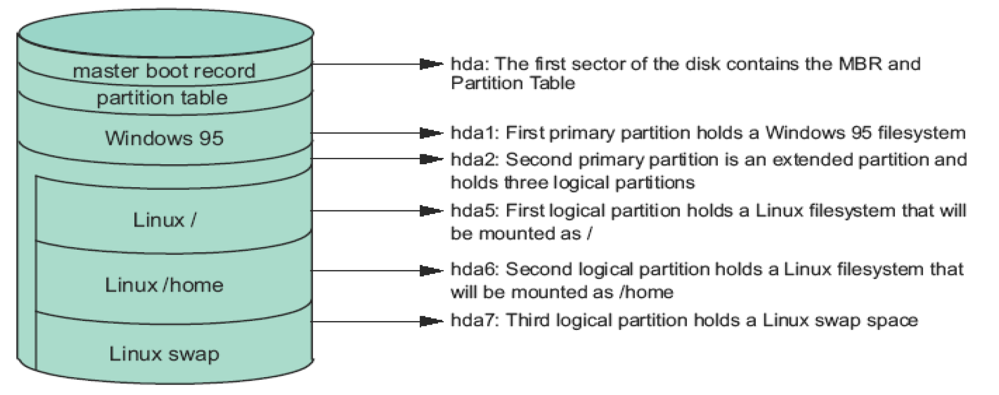

1. hda：磁盘的第一个扇区包含MBR和分区表(早期的都是MBR组织的，后面使用了GPT(使用GUID分区表))
2. hda1：第一个主分区包含Windows 95文件系统
3. hda2：第二主分区是扩展分区，拥有三个逻辑分区
4. hda5：第一个逻辑分区包含一个Linux文件系统，该文件系统将被安装为/
5. hda6：第二个逻辑分区包含一个Linux文件系统，该文件系统将挂载为/home
6. hda7：第三个逻辑分区拥有一个Linux交换空间
7. 上图中表示是一个双系统，所以同时有windows和linux

## 2.2. 主引导记录
1. 大小：512字节(hd的第一个扇区)
   1. 由BIOS寻址
   2. 内容：
      1. 446字节的程序代码(用于引导操作系统)
      2. 最大64字节的分区表 4条目
      3. 2个字节的"幻数"(0x55AA)

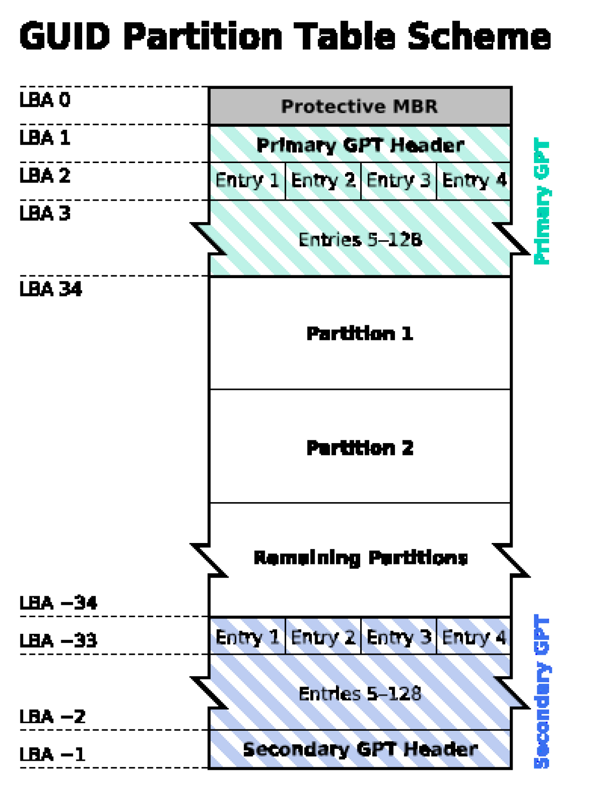

## 2.3. 文件系统
1. 什么是文件系统
   1. 操作系统中负责访问和管理文件的部分
   2. 文件及其某些属性的集合。它为引用这些文件的文件序列号提供了名称空间。(susv3)
2. Linux中的文件系统：
   1. VFS
   2. EXT2，EXT3，FAT32等

## 2.4. 磁盘分区
1. 至少要创建
   1. /，750MB(建议1.5G或更高)
   2. 交换，大小等于内存量
2. 推荐：/boot(16MB)
3. 可能需要/想要创建其他分区：/usr，/usr/local，/var，/tmp，/opt，/home
4. Linux下的默认分区程序是fdisk，发行版可以添加自己的分区程序

## 2.5. Linux启动流程
1. BIOS：检查内存，从非易失性内存中加载选项，检查启动设备，加载启动设备的MBR并执行它
2. MBR
   1. 包含一个"boot loader"和分区表
   2. 由LILO/GRUB进行传统设置
3. 引导加载程序
   1. 将压缩的内核映像加载到内存中
   2. 内核解压缩并启动...
4. 初始化过程
   1. 配置文件/etc/inittab
   2. 运行水平

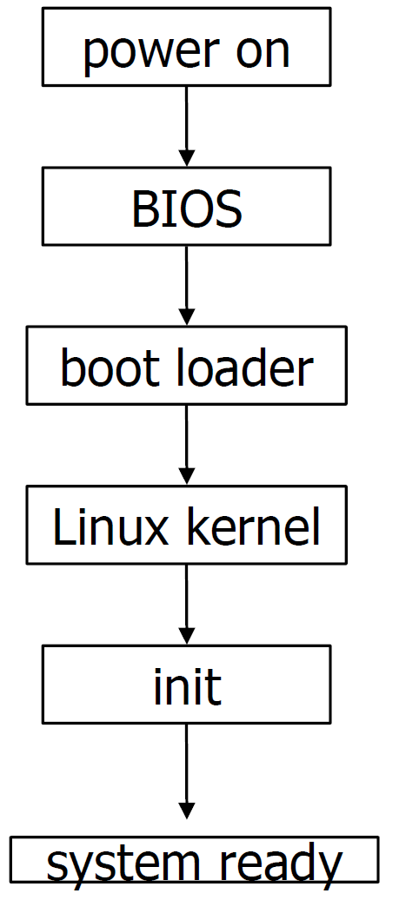

## 2.6. 基本输入输出系统(BIOS)
1. 查内存和硬件(POST)
2. 从非易失性存储器中加载选项
   1. 内存时序
   2. 启动设备顺序
3. 检查启动设备
   1. 软盘，CD-ROM，硬盘等
4. 加载启动设备的MBR并执行

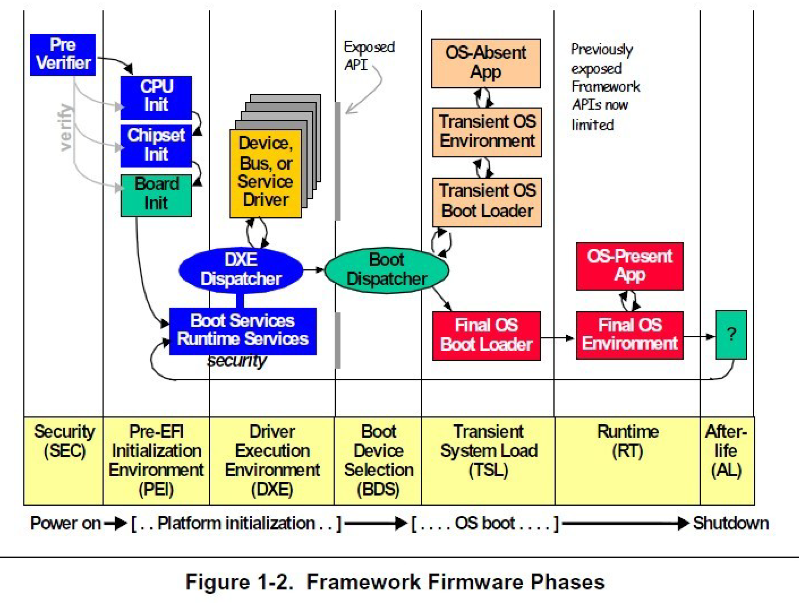

## 2.7. 引导加载程序
1. 引导加载程序加载并启动Linux内核
   1. 可以将启动参数传递给Linux内核，例如设备信息
   2. 可以选择加载初始根磁盘
   3. 也可以启动其他操作系统
2. 通用引导加载程序：
   1. LILO：Linux加载程序
   2. GRUB：Grand Unified Boot Loader
3. 除非使用其他引导加载程序，否则通常在/dev/hda中进行配置。

## 2.8. LILO-Linux加载程序
1. LILO
   1. 根据配置文件配置MBR的程序。
   2. 必须使用lilo命令以root用户身份运行。
2. lilo command语法：
   1. lilo[-v] [-v] [-C配置文件] [-t]
   2. 配置文件：/etc/lilo.conf

## 2.9. GRUB-GRand统一引导加载程序
1. GRUB
2. 程序存储在MBR(第一阶段)和/boot/grub(1.5和第二阶段)中
3. 了解文件系统结构； 无需像LILO一样激活配置
4. 配置文件/boot/grub/grub.conf
5. 通过grub-install安装在MBR中

```
title Ubuntu, kernel 2.6.20-16-generic
root (hd0,1)
kernel /boot/vmlinuz-2.6.20-16-generic root=UUID=3f784cd9-516f-4808-a601-b19356f6bdea ro quiet splash locale=zh_CN vga=0x318
initrd /boot/initrd.img-2.6.20-16-generic

title Microsoft Windows XP
Professional root(hd0,0)
savedefault
makeactive
chainloader +1
```

## 2.10. 使用系统
1. 基础知识
2. 使用文件和目录
3. 处理流程
4. Linux文档

## 2.11. 安装Linux软件
1. From a tarball
   1. tar zxvf application.tar.gz
   2. cd application
   3. ./configure
   4. make
   5. su -
   6. make install
2. apt-get command *
3. dpkg
4. aptitude
5. yum + rpm
6. RPM: RPM Package Management
   1. rpm –q –a
   2. rpm –ivh package-name
   3. rpm –e package-name

# 3. 使用系统

## 3.1. 多用户和多任务
1. Linux是一个多用户，多任务的操作系统：多个用户可以同时运行多个彼此独立的任务。
2. 在使用系统之前，总是需要"登录"：用用户名，密码识别自己
3. 多种登录系统的方式
   1. 控制台：直接连接的键盘，鼠标，显示器
   2. 串口
   3. 网络连接

## 3.2. 虚拟终端
1. 在大多数Linux发行版中，控制台模拟许多虚拟终端
2. 每个虚拟终端都可以看作是一个单独的直接连接的控制台：不同的用户可以使用不同的虚拟终端
3. 典型设置：
   1. VT1-6：文本模式登录
   2. VT7：图形模式登录提示(如果启用)
   3. 使用Alt-Fn(如果在X中为Ctrl-Alt-Fn)在VT之间切换

## 3.3. Linux命令
1. Linux系统上的所有操作都可以通过键入命令来完成：运行Linux系统不需要GUI(X-Window)
2. 为了在X-Window中键入命令，您需要启动终端仿真器
3. 命令提示
   1. 可以自己配置
   2. $：以普通用户身份登录
   3. #：以root身份登录

## 3.4. 命令语法
1. Linux命令具有以下格式：$ 命令选项参数
2. 示例：
   1. $ ls
   2. $ ls –l
   3. $ ls / dev
   4. $ ls –l / dev

## 3.5. 一些基本的Linux命令
1. passwd：更改密码
2. mkpasswd：生成随机密码
3. date，cal：找出今天的日期并显示日历
4. who，finger：找出谁在系统上处于活动状态
5. clear：清除屏幕
6. echo：在屏幕上写一条消息
7. write、fall、talk、mesg

## 3.6. 处理文件和目录
1. 什么是文件？
   1. 数据收集
   2. 可以写入或读取或两者兼有的对象。 文件具有某些属性，包括访问权限和类型(susv3)
2. 文件结构
   1. 通常：字节流，记录序列，记录树
   2. 在Linux中：字节流

## 3.7. 文件类型
1. 常规文件：文本或代码数据； 没有特别的内部结构
2. 字符特殊文件
3. 阻止特殊文件
   1. 特殊文件：代表硬件或逻辑设备
   2. 位于名为/dev的目录中
4. socket
5. 符号链接
6. 目录：该目录中的文件列表
7. 考试要注意是7种

## 3.8. 目录结构
1. 所有Linux目录都包含在一个虚拟的"统一文件系统"中。
2. 物理设备安装在安装点上
   1. 软盘
   2. 硬盘分区
   3. CD-ROM驱动器
3. 没有驱动器号，例如A:，C:，...

## 3.9. 目录结构的一个例子
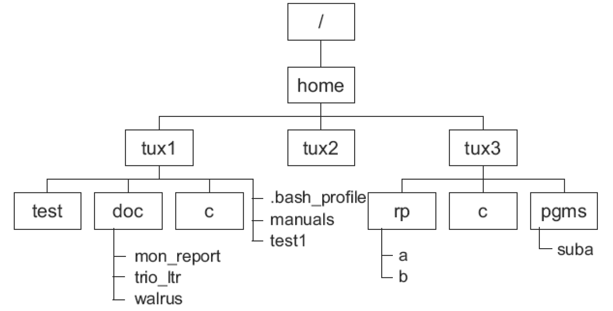

## 3.10. Linux中的主要目录
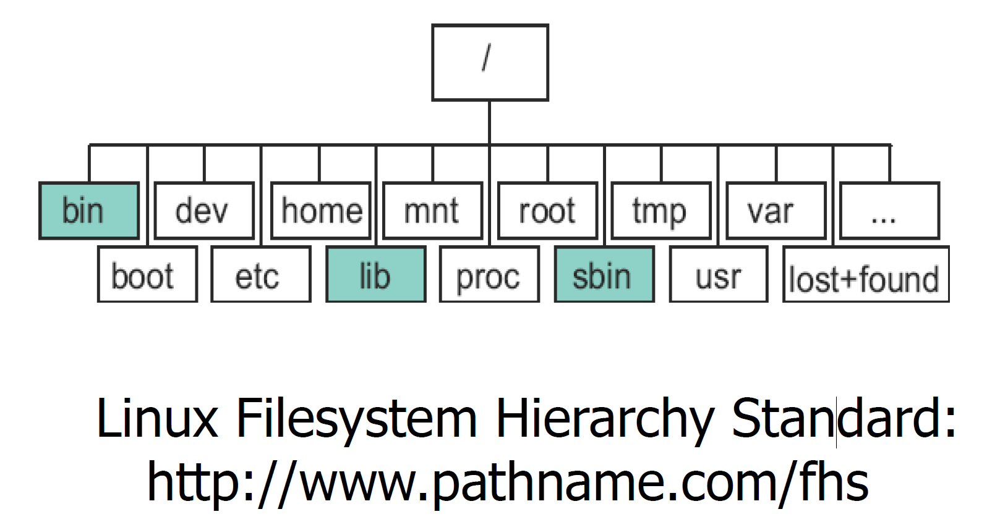

## 3.11. 基础命令
1. 与目录一起使用的命令：
   1. pwd：打印工作目录
   2. cd：更改目录
   3. mkdir：创建目录
   4. rmdir：删除目录
   5. ls：列出目录的内容，-l，-a，-R选项
2. 与文件一起使用的命令：
   1. touch：更新文件的访问和/或修改时间
   2. cp：复制文件
   3. mv：移动并重命名文件
   4. ln：链接文件
   5. rm：删除文件
   6. cat：打印文件内容
   7. more/less：逐页显示文件

## 3.12. 文件权限
1. 文件权限可帮助您保护文件免受他人侵害系统上的用户
2. 三个访问级别：
   1. 用户：创建文件的用户
   2. 组：拥有文件的组中的所有用户
   3. 其他：其他
3. 三个权限：
   1. 读取(r)：读取文件内容或列表内容目录
   2. 写(w)：更改文件内容或创建/删除文件在目录中
   3. 执行(x)：以程序执行文件或使用目录作为活动目录

## 3.13. 查看文件权限
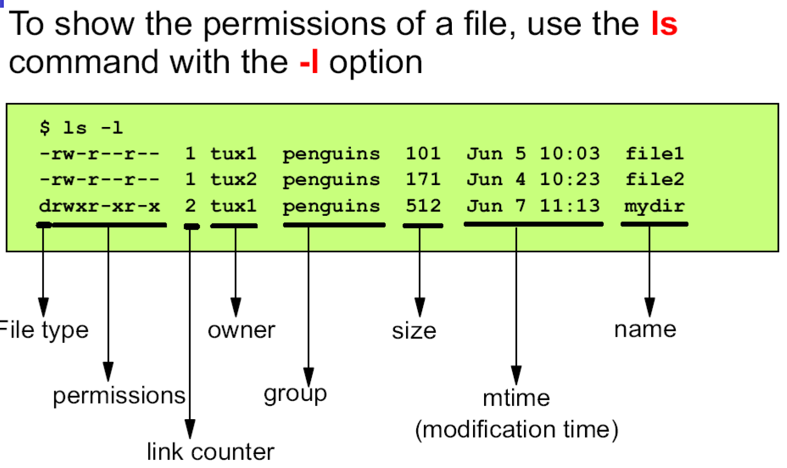

## 3.14. 更改权限
| 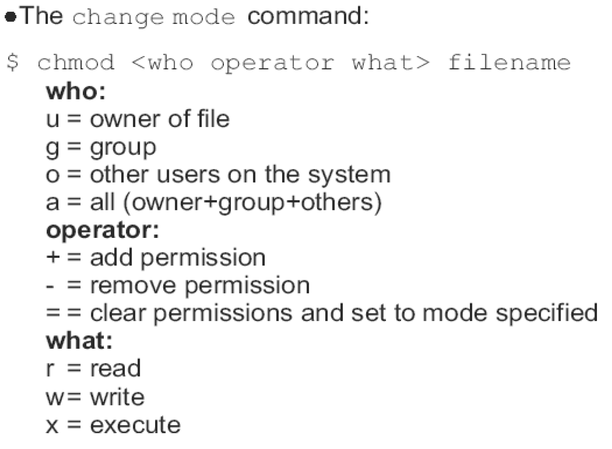 | 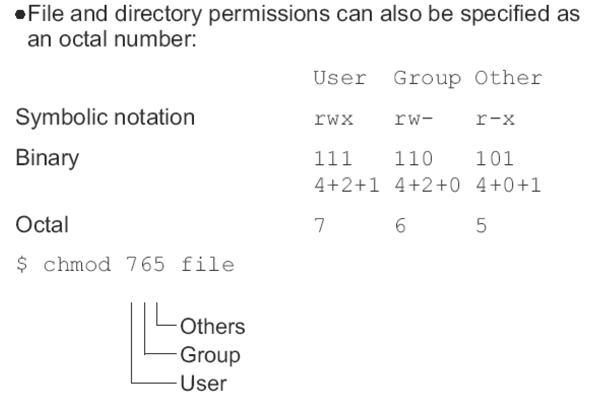 |
| -------------------- | -------------------- |

## 3.15. 默认文件权限
1. 新建文件和目录的默认权限为：

```
File: -rw-r--r--644
Directory: drwxr-xr-x 755
```

## 3.16. 编辑文件
1. vi
2. emacs
3. gedit
4. …

## 3.17. 处理进程
1. 什么是进程？
   1. 进程是一项任务。
   2. 进程是一个正在执行的程序实例。由执行程序，它的当前值，状态信息以及通过操作系统管理此进程执行情况的资源组成。
   3. 一个地址空间，在该地址空间中执行一个或多个线程，以及这些线程所需的系统资源(susv3)
2. 正在运行的程序就是流程的一个示例

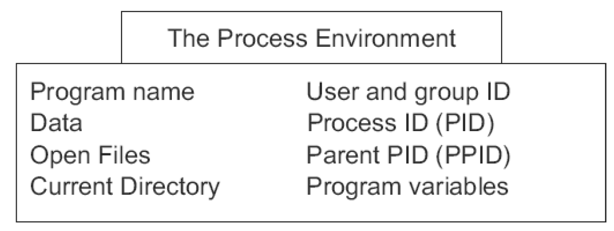

3. shell是一个读取命令并启动适当过程的过程。

## 3.18. 开始和停止进程
1. 所有流程均由其他流程启动
   1. 父母/子女关系
   2. 一个例外：init（PID 1）由内核本身启动
   3. 树的层次结构
2. 可以终止进程的原因有两个：
   1. 该进程完成后会自行终止。
   2. 该进程被另一个进程的信号终止

## 3.19. 基本命令
1. ps：报告进程状态
2. pstree：显示进程树
3. jobs，fg，bg，<ctrl-z>：作业控制
4. kill：
5. nohup：运行命令，忽略挂断信号
6. nice，kill：
7. top：显示最热门的CPU进程

## 3.20. 镜像
1. "守护程序"一词指的是一个永无止境的进程，通常是控制诸如打印机队列之类的系统资源或执行网络服务的系统进程。

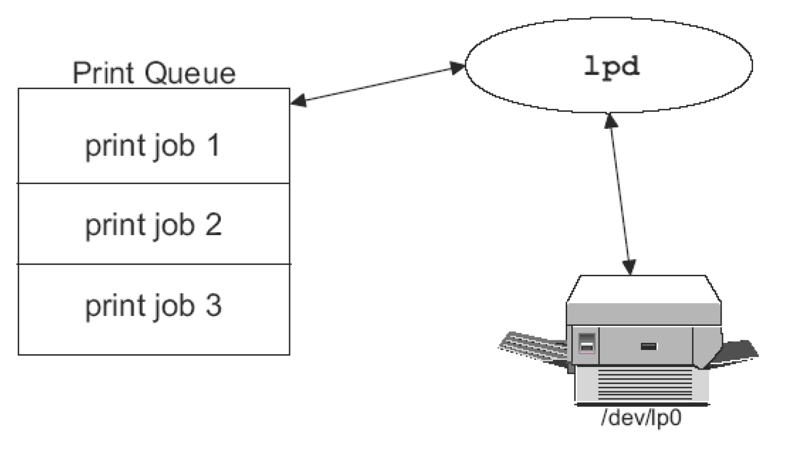

## 3.21. 如何寻求帮助？
1. "man"命令
2. info
3. command--help
4. HOWTO文档
5. 参考互联网

## 3.22. man 命令
1. 使用man命令，您可以阅读命令的手册页
2. 手册页存储在/usr/man中
3. 手册页包括：
   1. 名称：命令名称和在线说明
   2. 简介：命令的语法
   3. 说明：有关命令的工作方式及其作用的说明
   4. 文件：命令使用的文件
   5. 错误：已知的错误和错误
   6. 另请参阅：与此命令相关的其他命令
4. "-k"选项：man–k打印
5. 手册分为8个部分：
   1. 用户命令
   2. 系统调用
   3. 库调用
   4. 设备
   5. 文件格式和协议
   6. 游戏
   7. 公约，宏程序包等
   8. 系统管理
6. 要选择正确的部分，请添加部分编号：man1 passwd，man 5 passwd

## 3.23. info 命令
1. 用于阅读文档的程序，有时可以代替手册页
2. 有关信息的信息存储在/ usr / info中
3. 一些信息命令：
   1. space：下一屏文字
   2. delete：上一屏文字
   3. n：下一个节点
   4. p：上一个节点
   5. u：上节点
   6. q：退出信息
   7. < tab >：跳至下一个菜单项

# 4. 练习
1. 浏览网站：
   1. http://www.gnu.org
   2. http://www.linux.org
2. 安装一种Linux Distribution，然后在其上安装一些需要的软件
3. 学习Linux基本命令的使用
4. 复习C程序设计语言

# 5. UNIX Overview
1. 早期的UNIX
   1. 一个简单的文件系统
   2. 一个进程子系统和一个Shell
2. 内核和核外程序

| 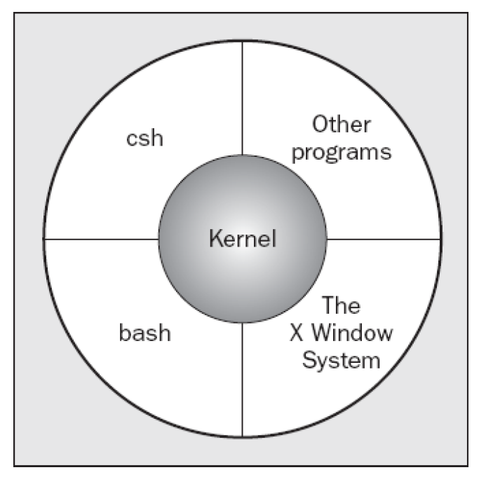 | 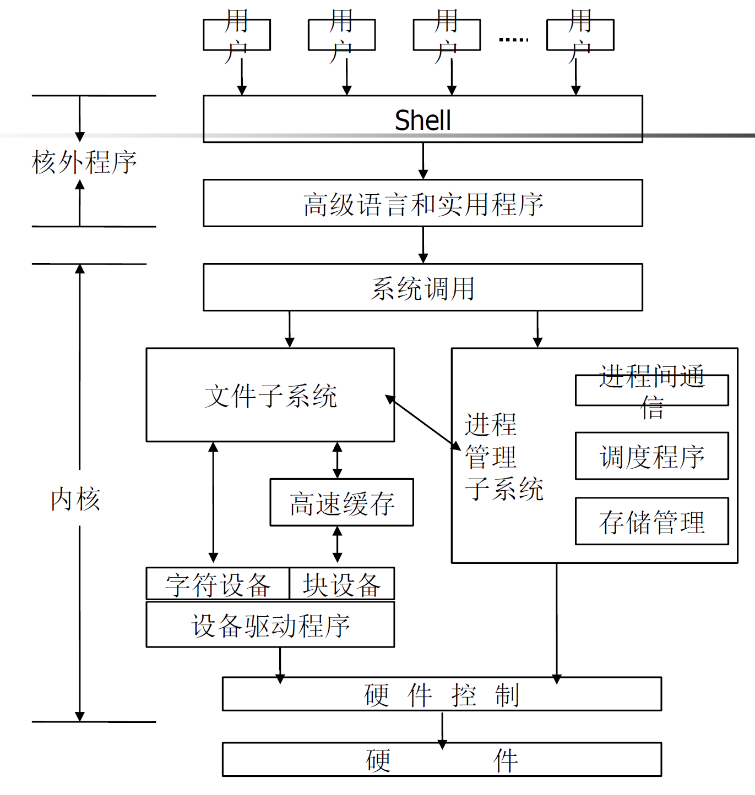 |
| -------------------- | -------------------- |

# 6. Programmer’s Viewpoint
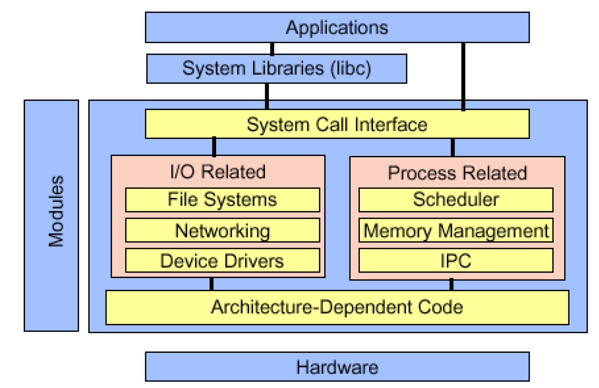

# 7. 基本命令(1)
1. 文件操作
   1. 列出目录内容: ls, dir, vdir
   2. 创建特殊文件: mkdir, mknod, mkfifo
   3. 文件操作: cp, mv, rm
   4. 修改文件属性: chmod, chown, chgrp, touch
   5. 查找文件: locate, find
   6. 字符串匹配: grep(egrep)
   7. 其它: pwd, cd, ar, file, tar, more, less, head, tail, cat
2. 进程操作：ps, kill, jobs, fg, bg, nice
3. 其它
   1. who, whoami, passwd, su, uname, …
   2. man

# 8. 重定向
1. 标准输入、标准输出、标准错误
   1. 对应的文件描述符：0, 1, 2
   2. C语言变量：stdin, stdout, stderr
2. <, >, >>, 2>
   1. 例：kill –HUP 1234 > killout.txt 2> killerr.txt
   2. 例：kill –HUP 1234 > killout.txt 2>& 1

# 9. 管道
1. 一个进程的输出作为另一个进程的输入
2. 例:
   1. ls | wc –l
   2. ls –lF | grep ^d
   3. ar t /usr/lib/libc.a | grep printf | pr -4 -t

# 10. 环境变量
1. 环境变量
   1. 操作环境的参数
   2. 查看和设置环境变量：echo, env, set
2. 例: PATH环境变量
   1. echo $PATH
   2. /usr/local/bin:/bin:/usr/bin:/usr/X11R6/bin:/home/song/bin
   3. PATH=$PATH:.
   4. export PATH

# 11. 高级命令与正则表达式
1. find
2. sed：sed 's/\([0-9A-Za-z_]\{1,\}\)\[ \{0,\}\]\[ \{0,\}\]/*\1\[\]/g' code1.cpp
3. grep