Lec3-Linux Programming Prerequisite
---

# 1. 编程原则
1. 抽象和具体
2. 库(API)的调用与选择：从技术角度，一般使用标准库，如果使用商业库，则会给对方平台带来一定的收益，但是对自己而言，平台移植性比较低。

# 2. 编程工具
1. 编辑工具：vi, emacs
2. 编译、链接：gcc
3. 调试：gdb
4. make命令
5. 版本控制工具：CVS等
6. 永久修改环境变量的方法`profile`，但是当前窗口修改是不影响的。

# 3. 编程语言
1. 更高层语言
   1. C/C++，Java，Fortan
   2. ELF binary format
      1. Excutable and Linkable Format
         1. windows下可执行文件的封装格式: MZ
         2. linux下的可执行文件封装格式: ELF，封装一般发生在链接过程中
      2. 工具接口标准委员会(TIS)选择了正在发展中的ELF体系上不同操作系统之间可移植的二进制文件格式
2. 脚本
   1. Shell: sh/bash, csh, ksh
   2. Perl, Python tcl/tk, sed, awk
3. 执行方式
   1. 编译执行:会先编译为本地的 byte code字节码(C#， VB.net 叫TL)，然后再配备对应的解释器(比如java的JVM)，解释为CPU可以执行的binary code二进制码，然后放到CPU执行
   2. 解释执行:不编译，直接读一行执行一行

# 4. 开发工具
1. GCC：Linux下的C++编译器，微软的C++编译器：cl，开源编译器：clang，和gcc差不多。
   1. GNU C Compiler -> GNU Compiler Collection
   2. The gcc command: Front end
2. GDB
   1. GNU Debugger
   2. The gdb command
   3. xxdgb, ddd…
3. Binary utilities 附带元件
   1. as, ld, ar, ldd…
4. Make

# 5. 最简单的编译连接图(Win)


# 6. 编译链接图(展开)
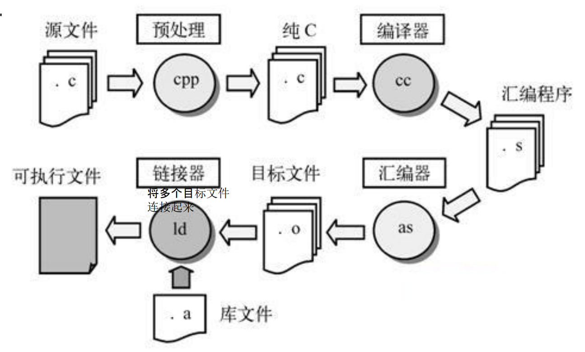

1. 每一个源代码和目标文件是一一对应的
2. 链接器是将所有的目标文件进行链接
3. 打包后就得到了.a(也就是一个静态库)
4. 为什么需要静态库：
   1. 因为随着开发的推进，程序越来越大，则需要通过静态库的方法来降低复杂度。
   2. 升级更新要尽量做到是增量更新的
   3. 但是静态库会导致复用性降低，磁盘过多被占用
5. 动态库的作用
   1. 不放在可执行文件中，放在外面
   2. 升级的时候会很方便
   3. 动态库会存在冲突(版本问题)

```c++
if(){

}else{

}
// 预处理操作
#if
#else
#endif
```

6. gcc参数：
   1. `-c`:只做编译，不做链接

# 7. 编译链接图(头文件展开)

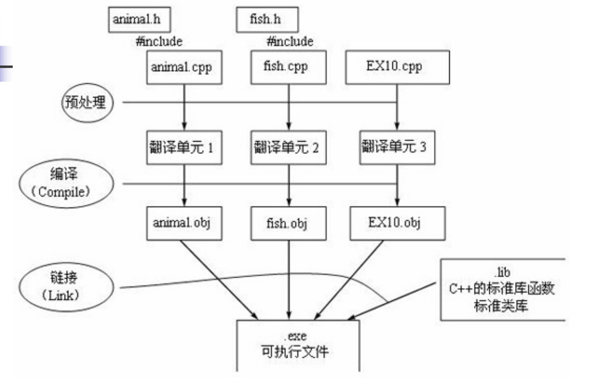

头文件

`#include<...h>`：**预处理阶段，在编译之前**，按照文件名找到文本文件，将文本内容替换掉这个头文件。

头文件中有什么呢？

```c
int Qtf(char*);
int mian(int argc, char** argv){
  Qtf("Hello");
  return 0
}
```

```linux
gcc -o lin.o -c linux002.c
// 这个不会报错，即编译器不会报错
gcc -o lin.o linux002.c
// 这个会报错，链接器会报错
```

# 8. 编译链接
1. 头文件和#include (预处理 – 编译时处理)
2. 为什么要做链接？(link)
3. 静态库与动态库

## 8.1. 依赖库和头文件
1. 静态库(.a 文件)：Lab(gcc + ar)
2. 动态库/共享对象(.so 文件)：Lab(gcc)

## 8.2. 其他语言
1. Java (只有编译+解释执行)
2. .Net平台 (VB.net, C# C++.net等)
3. VC++ 及 Delphi 等 (一般称为Win编程)


## 8.3. 编译的具体过程
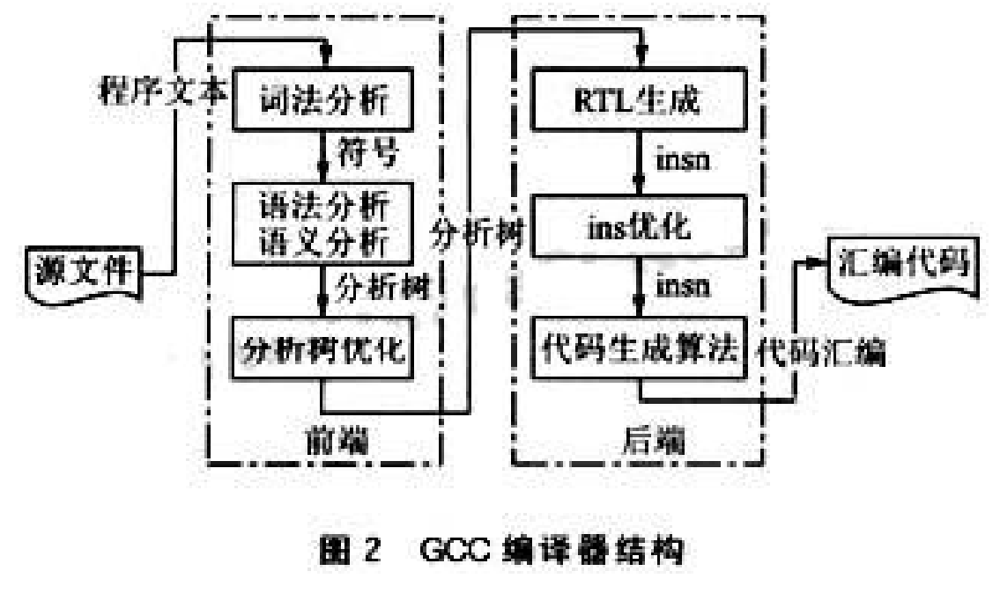

## 8.4. 前端和后端


## 8.5. 常用命令
1. `gcc -c (编译)`
2. `gcc (链接 或者 编译 + 链接)`
3. `g++ (C++对应的命令，其实就是换了前端)`

### 8.5.1. gcc可选项(要背，考试会考)
1. Usage:
   1. gcc [options] [filename]
2. Basic options:
   1. -E: 只对源程序进行预处理(调用cpp预处理器)
   2. -S: 只对源程序进行预处理、编译
   3. -c: 执行预处理、编译、汇编而不链接
   4. -o output_file: 指定输出文件名
   5. -g: 产生调试工具必需的符号信息
   6. -O/On: 在程序编译、链接过程中进行优化处理
   7. -Wall: 显示所有的警告信息
3. Basic options:
   1. `-Idir`: 指定额外的**头文件**搜索路径
   2. `-Ldir`: 指定额外的**库文件**搜索路径
   3. `-lname`: 链接时搜索指定的库文件
   4. `-DMACRO[=DEFN]`: 定义MACRO宏(针对#define)
4. 编译后调试一般在一台机器上，而不会在多台机器
5. 补充：
   1. 调试的时候仍然使用的是本地编译好的二进制文件
   2. 编译的时候没开优化，源代码的语句编译成的汇编码是多条语句，是一对多的关系
   3. 调试器：在执行编译后的二进制码，二进制码会被打标签，记录哪一个源代码的哪一行编译而来的。
   4. -g参数：告诉编译器，每一个编译完的二进制码上打上文件名和行号的标签
   5. 编译完之后，用其他的机器调试可能是不行的，因为file的路径一般是不一样的。
   6. -O优化，二进制码打乱，不优化的话，源代码和汇编代码是对应着的；一些无关的操作会被编译器扔掉；会把源代码和汇编码之间一对多的关系破坏掉
6. 在不改变源代码的基础上，在文件中添加#define预处理指令。

```shell
gcc -DAA=2
# 就相当于在源码中添加了#define AA 2
```

7. 链接器在链接的时候如何找到库文件？
8. 编译器不需要额外指定头文件的文件名(因为源码中有头文件名)

```shell
-lm
# 库文件名为libm.a
```

### 8.5.2. 文件后缀名


### 8.5.3. GDB
1. GDB: GNU Debug
   1. 设置断点
   2. 监视变量值
   3. 单步执行
   4. 修改变量值
2. GDB commands

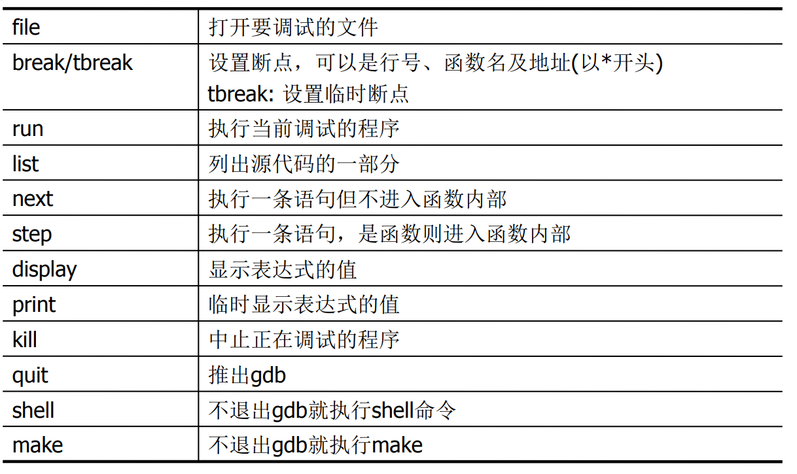

### 8.5.4. make & makefile
1. Multi-file project
   1. IDE
   2. make
2. make & makefile
   1. makefile描述模块间的依赖关系；
   2. make命令根据makefile对程序进行管理和维护；make判断被维护文件的时序关系
3. Hello 的 Makefile

```makefile
TOPDIR = ../
include $(TOPDIR)Rules.mak
EXTRA LIBS += :
EXEC = $(INSTALL_DIR)/hello
OBJS = hello.o # make uninstall之后系统中源代码仍然存在
# 变量定义，makefile可以include别的makefile

all: $(EXEC) # 默认执行make all
  $(EXEC): $(OBJS)
  $(CC) $(LDFLAGS) -0 $@ $(OBJS) $(EXTRA_ LIBS) # gcc的别名CC，$@明确了目标文件放置位置
install:
  $(EXP_ INSTALL) $(EXEC) $(INSTALL_ DIR) # make install执行的指定目标
clean:
  -rm -f $(EXEC) *.elf*.gdb *.o
```

3. **定义整个工程的编译规则**：
   1. 一个工程中的源文件不计数，其按类型、功能、模块分别放在若干个目录中，makefile定义了一系列的规则来指定，哪些文件需要先编译，哪些文件需要后编译，哪些文件需要重新编译，甚至于进行更复杂的功能操作 。
4. **自动化编译**：
   1. **只需要一个make命令**，整个工程完全自动编译
   2. make是一个命令工具，是一个解释makefile中指令的命令工具；
5. 默认情况下，每执行一条 makefile 中的命令之前，**Shell 终端都会显示出这条命令的具体内容**，除非该命令用分号分隔而紧跟在依赖关系后面，我们称之为"回显"。如果不想显示命令的具体内容，我们可以在命令的开头加上"@"符号，这种情况通常用于 echo 命令。
6. `${MAKE}`就是预设的 make 这个命令的名称（或者路径）。
7. GNU make是一个命令工具，是一个用来控制软件构建过程的自动化管理工具。Make工具通过称为Makefile的文件来完成并自动维护编译工作,由Richard Stallman与Roland McGrath设计开发。
8. Makefile是用于自动编译和链接的，一个工程有很多文件组成，每一个文件的改变都会导致工程的重新链接，但是不是所有的文件都需要重新编译，Makefile中记录有文件的信息，在make时会决定在链接的时候需要重新编译哪些文件。
9. make命令格式：`make [-f Makefile] [option] [target]`
10. `#make target #make #make clean`

### 8.5.5. make
1. `make [-f filename] [targetname]`
2. Targets
   1. A target is usually the name of a file that is generated by a program; examples of targets are executable or object files.
   2. A target can also be the name of an action to carry out, such as 'clean' (phony target).
3. make install 需要 root 权限
4. 如果 config 的时候使用 root 权限，则编译后产生的所有文件都需要root权限
5. 直接make命令，则**执行的就是编译链接的部分**。

```shell
# automake方式
./configure #生成新的makefile
make
make install
make uninstall
make clean
make distclean# 退回到configure之前(删除makefile)
```

### 8.5.6. Makefile 规则结构
```bash
target ... : prerequisites ... 
command
```

1. target是一个目标文件，可以是Object File，也可以是执行文件
2. prerequisites是要生成target所需要的文件或是目标
3. command是make需要执行的命令。(可以是任意的Shell命令)
4. 举例：依赖关系，如果后面的文件更新，则执行如下代码，若输出文件不存在是执行如下代码则为违反规则。

```makefile
hello : main.o kbd.o
  gcc -o hello main.o kbd.o
main.o : main.c defs.h
  cc -c main.c
kbd.o : kbd.c defs.h command.h
  cc -c kbd.c
clean :
  rm edit main.o kbd.o # 伪目标
```

5. 只是匹配次序，并不是执行次序。
6. make的执行：时间戳检查、文件检查。

### 8.5.7. Hello的makefile
```makefile
TOPDIR = ../
include $(TOPDIR)Rules.mak
EXTRA_LIBS +=
EXEC = $(INSTALL_DIR)/hello
OBJS = hello.o
all: $(EXEC)
   $(EXEC): $(OBJS)
   $(CC) $(LDFLAGS) -o $@ $(OBJS) $(EXTRA_LIBS)
install:
   $(EXP_INSTALL) $(EXEC) $(INSTALL_DIR)
clean:
   -rm -f $(EXEC) *.elf *.gdb *.o
```
### 8.5.8. Makefile 执行次序
1. make会在当前目录下找名字叫"Makefile"或"makefile"的文件。
2. 查找文件中的第一个目标文件(target)，举例中的hello
3. 如果hello文件不存在，或是hello所依赖的文件修改时间要比hello新，就会执行后面所定义的命令来生成hello文件。
4. 如果hello所依赖的.o文件不存在，那么make会在当前文件中找目标为.o文件的依赖性，如果找到则再根据那一个规则生成.o文件。(类似一个堆栈的过程)
5. make根据.o文件的规则生成 .o 文件，然后再用 .o 文件生成hello文件。

### 8.5.9. 伪目标
```makefile
clean:
   rm *.o hello
```
1. "伪目标"并不是一个文件，只是一个标签，所以make无法生成它的依赖关系和决定它是否要执行，只能通过显示地指明这个"目标"才能让其生效
2. "伪目标"的取名不能和文件名重名
3. 为了避免和文件重名的这种情况，可以使用一个特殊的标记".PHONY"来显示地指明一个目标是"伪目标"，向make说明，不管是否有这个文件，这个目标就是"伪目标"
4. 伪目标一般没有依赖的文件，但也可以为伪目标指定所依赖的文件。
5. 伪目标同样可以作为"默认目标"，只要将其放在第一个。

### 8.5.10. 多目标
1. 用处
   1. 当多个目标同时依赖于一个文件，并且其生成的命令大体类似，可以使用一个自动化变量"$@"表示着目前规则中所有的目标的集合
2. 举例

```makefile
bigoutput littleoutput : text.g
generate text.g -$(subst output,,$@) > $@ # 将$@中的output替换成空

#上述规则等价于
bigoutput : text.g
  generate text.g -big > bigoutput
littleoutput : text.g
  generate text.g -little > littleoutput 
```

### 8.5.11. 预定义变量
1. `$<` 第一个依赖文件的名称
2. `$?` 所有的依赖文件，以空格分开，这些依赖文件的修改日期比目标的创建日期晚
3. `$+` 所有的依赖文件，以空格分开，并以出现的先后为序，可能包含重复的依赖文件
4. `$^` 所有的依赖文件，以空格分开，不包含重复的依赖文件
5. `$*` 不包括扩展名的目标文件名称
6. `$@` 目标的完整名称
7. `$%` 如果目标是归档成员，则该变量表示目标的归档成员名称

```makefile
edit : main.o kbd.o command.o display.o \
  insert.o search.o files.o utils.o
  gcc -o edit main.o kbd.o command.o display.o \
  insert.o search.o files.o utils.o
main.o : main.c defs.h
  gcc -c main.c
kbd.o : kbd.c defs.h command.h
  gcc -c kbd.c
command.o : command.c defs.h command.h
  gcc -c command.c
display.o : display.c defs.h buffer.h
  gcc -c display.c
insert.o : insert.c defs.h buffer.h
  gcc -c insert.c
search.o : search.c defs.h buffer.h
  gcc -c search.c
files.o : files.c defs.h buffer.h command.h
  gcc -c files.c
utils.o : utils.c defs.h
  gcc -c utils.c
clean :
  rm edit main.o kbd.o command.o display.o \
  insert.o search.o files.o utils.o
OBJECTS = main.o kbd.o command.o display.o \
insert.o search.o files.o utils.o
edit : $(OBJECTS)
  gcc -o edit $(OBJECTS)
main.o : main.c defs.h
  gcc -c main.c
kbd.o : kbd.c defs.h command.h
  gcc -c kbd.c
command.o : command.c defs.h command.h
  gcc -c command.c
display.o : display.c defs.h buffer.h
  gcc -c display.c
insert.o : insert.c defs.h buffer.h
  gcc -c insert.c
search.o : search.c defs.h buffer.h
  gcc -c search.c
files.o : files.c defs.h buffer.h command.h
  gcc -c files.c
utils.o : utils.c defs.h
  gcc -c utils.c
clean :
  rm edit $(OBJECTS) 
```

### 8.5.12. 多目标扩展
1. 语法`<targets ...>: <target-pattern>: <prereq-patterns ...> <commands>`
2. 例子
   1. 目标从$object中获取
   2. "%.o"表明要所有以".o"结尾的目标，即"foo.o bar.o"，就是变量$object集合的模式
   3. 依赖模式"%.c"则取模式"%.o"的"%"，也就是"foo bar"，并为其加下".c"的后缀，于是依赖的目标就是"foo.c bar.c"

```makefile
objects = foo.o bar.o
all: $(objects)
$(objects): %.o: %.c
  $(CC) -c $(CFLAGS) $< -o $@

# 等价于如下
foo.o : foo.c
  $(CC) -c $(CFLAGS) foo.c -o foo.o
bar.o : bar.c
  $(CC) -c $(CFLAGS) bar.c -o bar.o
```

3. 编写方法：
   1. 遍历.c文件中的头文件依赖树，把每一个依赖的头文件都放到后面！gcc里面有参数。
   2. 不写.h的话：第一次编译连接不会有问题，但是若头文件发生更新，并不会重新编译
4. 多目标扩展
   1. 语法：`<targets ...>: <target-pattern>: <prereq-patterns ...><commands>... `
   2. 举例

```makefile
objects = foo.o bar.o
all: $(objects)
$(objects): %.o: %.c$(CC) -c $(CFLAGS) $< -o $@
```

5. 目标从$object中获取
6. "%.o"表明要所有以".o"结尾的目标，即"foo.o bar.o"，就是变量$object集合的模式
* 依赖模式"%.c"则取模式"%.o"的"%"，也就是"foo bar"，并为其加下".c"的后缀，于是依赖的目标就是"foo.c bar.c"

上述规则等价于

```makefile
foo.o : foo.c$(CC) -c $(CFLAGS) foo.c -o foo.o

bar.o : bar.c$(CC) -c $(CFLAGS) bar.c -o bar.o 
```

## 8.6. 使用函数
1. 调用语法
   1. `$(<function> <arguments>)`
   2. `${<function> <arguments>}`
2. 字符串处理函数
   1. `$(subst <from>,<to>,<text>)`
   2. `$(strip <string>)`
3. 文件名操作函数
   1. `$(dir <names...>)`
   2. `$(basename <names...>)`
4. foreach 函数
   1. `$(foreach <var>,<list>,<text>)`
5. if 函数
   1. `$(if <condition>,<then-part>)`
   2. `$(if <condition>,<then-part>,<else-part>)`
6. call函数
   1. `$(call <expression>,<parm1>,<parm2>,<parm3>...)`

# 9. 软件设计原则
1. 清晰原则
2. 吝啬原则
3. 扩展原则

# 10. File System
1. 文件
   1. 可以写入或读取或两者兼有的对象。 文件具有某些属性，包括访问权限和类型。
2. 文件系统
   1. 文件及其某些属性的集合。 它为引用这些文件的文件序列号提供了名称空间。

## 10.1. 文件系统的多种含义
1. 文件系统：Linux内核源代码情景分析，P415
   1. 指种特定的文件格式。例如，我们说Linux的文件系统是Ext2, MSDOS的文件系统是FATI6，而Windows NT的文件系统是NTFS或FAT32,就是指这个意思。
   2. 指按特定格式进行了"格式化"的块存储介质。当我们说"安装"或"拆卸"一个文件系统时，指的就是这个意思。
   3. 指操作系统中(通常在内核中)用来管理文件系统以及对文件进行操作的机制及其实现，这就是本章的主要话题。

## 10.2. 文件类型和结构
1. 文件类型
   1. 常规文件
   2. 字符专用文件
   3. 特殊块文件
   4. fifo
   5. socket
   6. 符号链接
   7. 目录
2. 文件结构
   1. 字节流； 没有特别的内部结构

## 10.3. Liunx中的文件系统
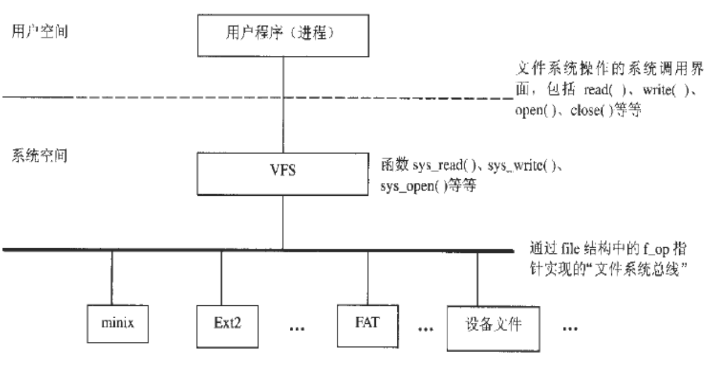

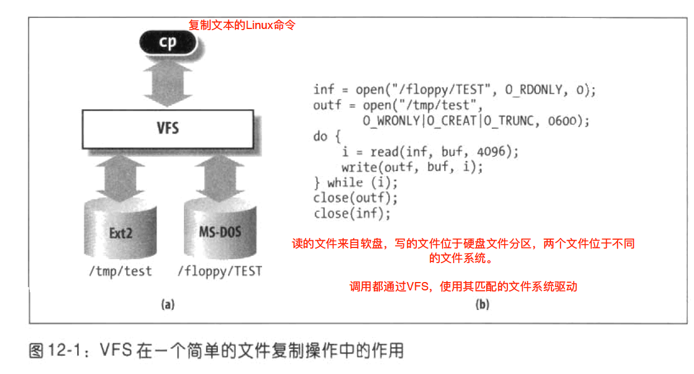

### 10.3.1. VFS模型(考试要考)
1. 虚拟; 仅存在于内存中
2. 组件：
   1. 超级块(super block):某一个磁盘的某一个分区的文件系统的信息
      1. 记录文件系统类型
      2. 记录文件系统的参数
   2. i节点对象(i-node object):index
      1. 记录的是真正的文件，文件存储在磁盘上时是按照索引号访问文件的
   3. 文件对象(file object)
      1. 记录的是文件描述符，索引号
      2. 不对应真正的文件，文件open后会创建出文件对象。
      3. 文件没有close，则内核中的文件对象就没有释放
   4. 目录对象(dentry object)

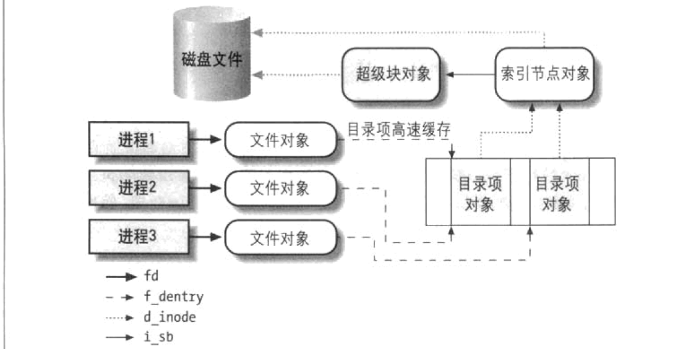

### 10.3.2. Ext2 文件系统
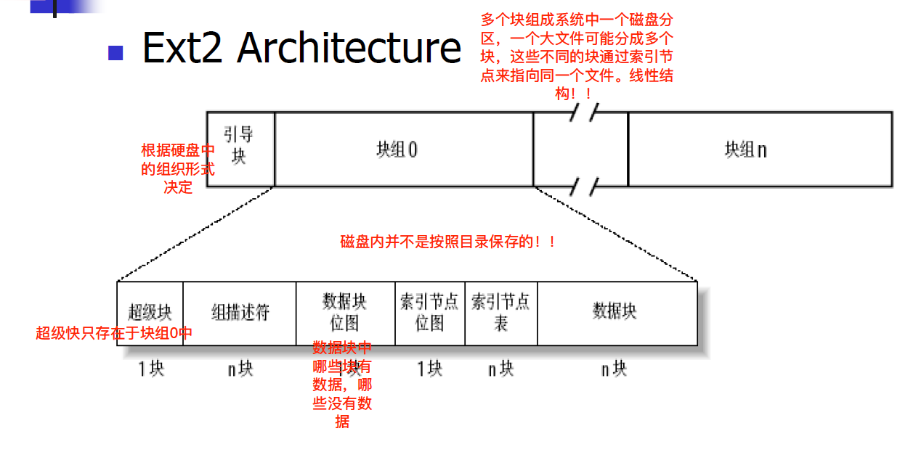

### 10.3.3. 硬链接和符号链接
1. Hard link
   1. 不同的文件名对应同一个inode
   2. 不能跨越文件系统
   3. 对应系统调用link
2. Symbolic link
   1. 存储被链接文件的文件名(而不是inode)实现链接
   2. 可跨越文件系统
   3. 对应系统调用symlink

### 10.3.4. 回顾命令：`ls -l`
1. 为了显示文件的可访问权限，我们在使用ls命令的时候同时使用-l参数

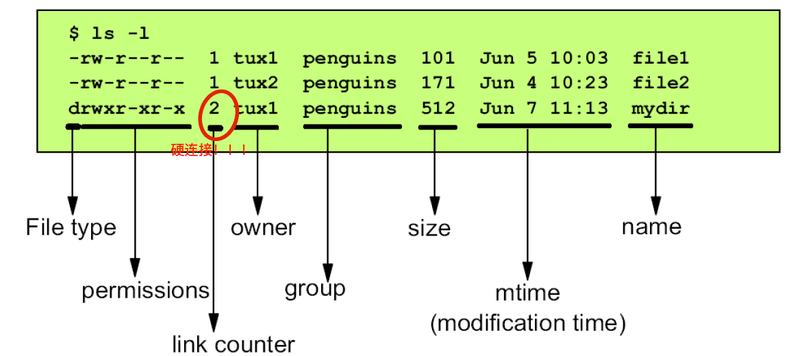

### 10.3.5. 系统调用和库函数
1. 都以C函数的形式出现
2. 系统调用
   1. Linux内核的对外接口; 用户程序和内核之间唯一的接口; 提供最小接口
3. 库函数
   1. 依赖于系统调用; 提供较复杂功能
   2. 例：标准I/O库

## 10.4. 无缓冲I/O和缓冲I/O
1. 无缓冲I/O
   1. 读写 -> 系统调用
   2. 文件描述符
   3. 并不是ANSI C，而是POSIX.1 和 XPG3
2. 缓冲I/O
   1. 通过标准I/O库来实现
   2. 处理很多细节，比如缓存分配
   3. 流 -> 指向FILE的指针

### 10.4.1. 标准I/O系统调用
1. 文件描述符
2. 标准I/O
   1. open/creat, close, read, write, lseek
   2. dup/dup2
   3. fcntl
   4. ioctl

#### 10.4.1.1. 文件描述符
1. 文件描述符
   1. 一个小的非负整数：`int fd`;
   2. 在`<unistd.h>`中
      1. STDIN_FILENO(0)，STDOUT_FILENO(1)，STDERR_FILENO(2)
2. 文件操作的一般步骤：open - read/write - [lseek] - close

#### 10.4.1.2. 例子
```c++
/* a rudimentary example program */
#include <fcntl.h>
main(){
   int fd, nread;
   char buf[1024]; // 打开一个字节的内容来打开文件
   /*open file "data" for reading */
   fd = open("data", O_RDONLY); // 系统调用C++中使用的fopen，返回文件描述符，一般返回3
   /* read in the data */
   nread = read(fd, buf, 1024);// 关闭的时候也用文件描述符关闭，释放句柄
   /* close the file */
   close(fd);
}
```

#### 10.4.1.3. open/creat 函数
1. 打开和建立一个文件或设备
2. C语言不能够重载，为什么会有2个open？并不是通过重载实现的，两个open是以一个函数的形式提供的，C语言提供了变长参数的函数机制。

```c++
#include <sys/types.h> // sys:linux系统下提供的头文件
#include <sys/stat.h>
#include <fcntl.h>

// open 也可以创建文件，覆盖了creat的所有功能
// pathname 含路径的文件名
// flags 标志位，是一串二进制数字，可以进行按位或曹旭哦，所以是int类型
// mode 文件权限
int open(const char *pathname, int flags);
int open(const char *pathname, int flags, mode_t mode);
// 创建文件的系统调用接口
// flag 给默认为只写O_WRONLY和清零O_TRUNC
int creat(const char *pathname, mode_t mode);
// (Return: a new file descriptor if success; -1 if failure)
```

#### 10.4.1.4. 参数 flag
1. "标志"：文件访问方式
   1. O_RDONLY，O_WRONLY或O_RDWR中的一个请求分别按以下方式对文件进行只读，只读或读/写操作，这些操作按零或多个进行按或运算：（全部在/usr/include/fcntl.h中定义 ）
      1. O_APPEND：以附加模式打开文件
      2. O_TRUNC：如果文件已经存在并且是常规文件，并且打开方式允许写入，则会将其长度截断为0。
      3. O_CREAT：如果文件不存在，将创建它。
      4. O_EXCL：与O_CREAT一起使用时，如果文件已存在，则为错误，打开失败。
2. "创建"功能：相当于以等于O_CREAT | O_WRONLY | O_TRUNC的标志打开
3. 使用`|`来分割多个参数

#### 10.4.1.5. 参数 mode
1. mode：指定在创建新文件的情况下使用的权限。
2. 取值情况


3. 需要多个权限的话，也是按位或。`S_IRUSR|S_IWUSR`就表示`rw-`。
4. 注意这里的权限是**4位八进制数**。

### 10.4.2. mode参数和umask
1. umask：文件保护机制
2. 新文件的初始访问方式
   1. mode和~umask

#### 10.4.2.1. close 函数
1. 选择一个文件描述符

```c++
#include <unistd.h>
int close(int fd);
//(Return: 0 if success; -1 if failure)
```

2. 注意**打开的文件一定要关闭**

#### 10.4.2.2. read/write 函数
1. Read from a file descriptor

```c++
#include <unistd.h>
ssize_t read(int fd, void *buf, size_t count);
//(返回值: 读到的字节数，若已到文件尾为0，若出错为-1)
```

2. Write to a file descriptor

```c++
#include <unistd.h>
ssize_t write(int fd, const void *buf, size_t count);
//(返回值: 若成功为已写的字节数，若出错为-1)
```

3. 例子
```c++
while ((n = read(STDIN_FILENO, buf, BUFSIZE)) > 0)
   if (write(STDOUT_FILENO, buf, n) != n)
      err_sys("write‏error");
   if (n<0)
      err_sys("read‏error");
```

#### 10.4.2.3. lseek函数
1. 重定义读写文件偏移量

```c++
#include <sys/types.h>
#include <unistd.h>
off_t lseek(int fildes, off_t offset, int whence);
// (Return: the resulting offset location if success; -1 if failure)
```

2. The‏directive‏"whence":
   1. SEEK_SET:‏the‏ offset ‏is‏ set‏ to‏ "offset" ‏bytes
   2. SEEK_CUR: the offset is set to its current location plus "offset"‏bytes
   3. SEEK_END:‏the‏offset‏if‏set‏to‏the‏size‏of‏the‏file‏plus‏"offset"‏ bytes

#### 10.4.2.4. dup/dup2函数
1. Duplicate a file descriptor

```c++
#include <unistd.h>
int dup(int oldfd);
int dup2(int oldfd, int newfd);
//(Return: the new file descriptor if success; -1 if failure)
```
2. File sharing，Example: **redirection**
3. 用在重定向中
   1. ls：本质就是对1号文件描述符写数据(无论是printf还是cout)
   2. 将原来1号文件描述符从控制台输出转到其他文件中
   3. 打开一个文件，就会有一个文件描述符(例如是3号文件描述符)，使用dup2系统调用，就可以实现了。

```c
dup2(1, 1000);
fd=open("aaa.txt", ...);
dup2(fd, 1);//使用打开文件的文件描述符覆盖1号的，进行重定向
dup(1000, 1);//当重定向好了之后将1000号覆盖掉1号
```

#### 10.4.2.5. fcntl 函数
1. Manipulate a file descriptor

```c++
#include <unistd.h>
#include <fcntl.h>
int fcntl(int fd, int cmd);
int fcntl(int fd, int cmd, long arg);
int fcntl(int fd, int cmd, struct flock *lock);//可以对文件加锁
//(返回值: 若成功则依赖于cmd，若出错为-1)
```
2. The‏ operation‏ is‏ determined ‏by‏"cmd".
3. The‏ value‏ of‏"cmd"
   1. **F_DUPFD**: Duplicate a file descriptor
   2. **F_GETFD/F_SETFD**:‏Get/set ‏the‏ file‏d escriptor's
   3. **‏close-on exec** flag：执行时是否关闭，文件描述符能否从父进程传递到子进程。
   4. F_GETFL/F_SETFL:‏Get/set ‏the‏ file ‏descriptor's **‏flags**(并不是所有情况都可以setfl的)
   5. F_GETOWN/F_SETOWN: Manage I/O availability signals(告诉当前进程是否I/O传来的信号)(不要求理解深刻)
   6. F_GETLK/F_SETLK/F_SETLKW: Get/set the file lock(暂时不讲)
4. Example：dup/dup2 and fcntl
5. fcntl对于文件描述符的操作很全面


1. pid保存进程id(可以理解为int类型，linux下做了类型的重定义)
2. `if(fd == -1)`：异常处理(文件打开失败)
3. `fcntl(fd, F_SETFD, 1);`这里将**close-on-exec** flag设置为true，所以**调用execl的时候，fd会关闭**。
4. `fork()`：Linux下很特别的系统调用，是用来创建进程的；复制一份父进程，作为父进程的子进程。(注意：被启动的子进程，就从fork()之后继续执行；子进程并不重复执行，某种程度上子进程和父进程是完全一样的；只有fork()系统调用的返回值不一样)
5. 父进程fork()函数的返回值就是子进程的pid，而子进程fork()函数的返回值是0。
6. 子进程是复制了父进程，所以这里子进程有fd这个文件描述符。
7. exec系列函数的使用
   1. **用另外一个程序代替当前进程，不会新开进程**(用当前进程执行新的程序)
   2. 启动一段新的程序，将新程序的内存覆盖掉当前进程的内存。
   3. 如果没有fork就执行execl，则当前shell的进程没有了(呗新的程序占用了)
8. 注意：
   1. 这里是`pid==0`，才会执行execl。所以是**子进程执行了这个execl**。
   2. `execl("ass", "./ass", &fd, NUKK)`：传递的是fd所在地址，这里是int类型的地址，而execl函数要求的传输类型是char类型的地址，所以这里是类型转换。(但是这里的fd的值不能太大，因为是按照char类型读取的，所以fd的值在128以内应该没有问题)
   3. `wait(NULL)`：父进程就在这里等待，知道子进程执行完ass
   4. 最后的执行结果：test.txt文件中只会有"ooooo"，不会有"zzzzz"

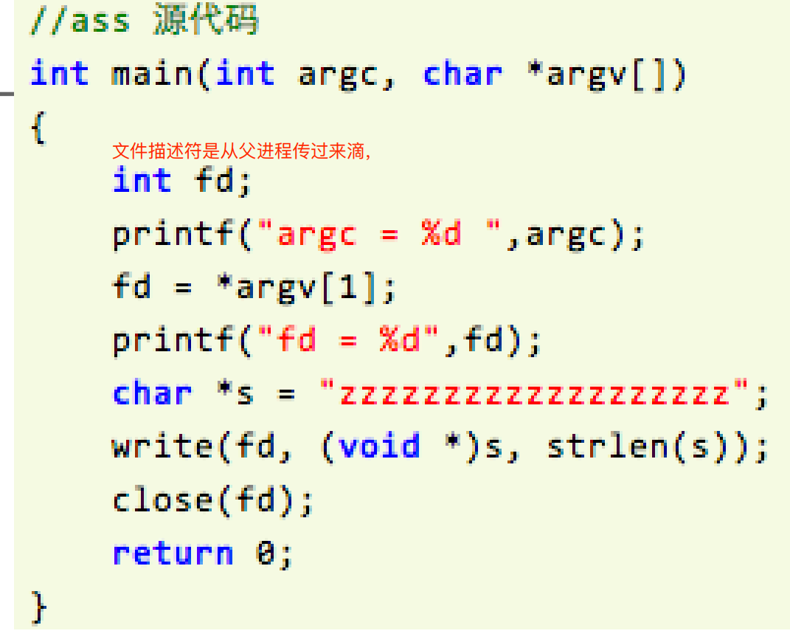

#### 10.4.2.6. ioctl Function
1. Control devices
```c++
#include <sys/ioctl.h>
int ioctl(int d, int request, ...);
```

1. 更改一种特殊类型的文件(块类型和字符类型的设备)

### 10.4.3. 标准I/O库
1. 文件系统
2. 标准I/O函数

### 10.4.4. 文件流
1. 流和文件结构
   1. `FILE * fp;`
   2. 预定义指针：`stdin, stdout, stderr`(封装了012号文件描述符)
2. 缓冲I/O
   1. 三类缓冲区
      1. 全缓冲区
      2. 行缓冲区
      3. 无缓冲区
   2. setbuf/setvbuf函数

### 10.4.5. 流缓冲操作
1. 三种缓冲
   1. 块缓冲（完全缓冲）
   2. 线缓冲
   3. 无缓冲
2. setbuf，setvbuf函数
```c++
#include <stdio.h> // 如果引入的是标准库，就不是系统调用，系统调用的输入参数一般是文件描述符而不是流指针
void setbuf(FILE *stream，char * buf);
int setvbuf(FILE *stream，char * buf, int mode, size_t size); // 类型: _IOFBF 满缓冲 _IOLBF 行缓冲 _IONBF 无缓冲
```

1. 补充：
   1. setbuf用于打开或关闭流缓冲机制，参数buf指向一个长度为BUFSIZ（该常量在<stdio.h>中定义）的缓冲区；如果要关闭缓冲，则将buf设置为NULL即可。
   2. setvbuf用于精确地设置所需的缓冲类型，mode取值如下：_IOFBF(全缓冲)/_IOLBF(行缓冲)/_IONBF(无缓冲)；如果指定了mode为带缓冲类型，而buf却为NULL，则系统会自动分配BUFSIZ个字节的缓冲区。

### 10.4.6. 标准I/O函数
1. Stream open/close
2. Stream read/write
   1. 每次一个字符的I/O
   2. 每次一行的I/O
   3. 直接I/O(二进制I/O)
   4. 格式化I/O
3. Stream reposition
4. Stream flush

#### 10.4.6.1. Stream open/close
1. Open a stream
```c++
#include <stdio.h>
FILE *fopen(const char *filename, const char *mode);
int fclose(FILE *stream);
```
2. Parameter‏"mode"
   1. "r": Open text file for **reading**.
   2. "w": Truncate file to zero length or create text file for writing.
   3. "a": Open for **appending**(追加).
   4. "r+": Open for **reading and writing**.
   5. "w+": Open for reading and writing. The file is created if it does not exist, **otherwise it is truncated**.
   6. "a+": Open for **reading and appending**. The file is created if does not exist.
3. Close a stream
```c++
#include <stdio.h>
int fclose(FILE *fp);
// (Return: 0 if success; -1 if failure)
```

#### 10.4.6.2. 输入字符
1. getc, fgetc, getchar functions

```c++
#include <stdio.h>
int getc(FILE *fp);
int fgetc(FILE *fp);
int getchar(void);
// (Result: Reads the next character from a stream and returns it as an unsigned char cast to an int, or EOF on end of file or error.)
```
2. Three functions:ferror, feof, clearerr
3. ungetc function: push a character back to a stream.

#### 10.4.6.3. 输出字符
1. putc, fputc, putchar functions

```c++
#include <stdio.h>
int putc(int c, FILE *fp);
int fputc(int c, FILE *fp);
int putchar(int c);
// (Return: the character if success; -1 if failure)
```

#### 10.4.6.4. 一行字符串输入
1. fgets, gets functions
```c++
#include <stdio.h>
char *fgets(char *s, int size, FILE *stream);
char *gets(char *s); //not recommended.
```
2. fgets: reads in at most **size-1** characters from stream and stores them into the buffer pointed by s. **Reading stops after an EOF or a new line**. A "\0" character is stored at the end of the buffer

#### 10.4.6.5. 一行字符串输出
1. fputs, puts functions

```c++
#include <stdio.h>
int fputs(const char *s, FILE *stream);
int puts(const char *s);
```

### 10.4.7. Question: I/O Efficiency
1. Rewrite mycat.c
   1. read/write version
   2. getc/putc version
   3. fgetc/fputc version
   4. fgets/fputs version

```c++
#include "ourhdr.h"

#define BUFFSIZE 8192

int main(void){
   int n;
   char buf[BUFFSIZE];
   
   while((n = read(STDIN_FILENO, buf, BUFFSIZE)) > 0){
      if(write(STDOUT_FILENO, buf, n) != n){
         err_sys("write error");
      }
   }
   if(n < 0){
      err_sys("read error");
   }
   exit(0);
}
```


```c++
#include "ourhdr.h"

int main(void){
   int c;
   while((c = getc(stdin)) != EOF){
      if(putc(c, stdout) == EOF){
         err_sys("output error");
      }
   }
   if(ferror(stdin)){
      err_sys("input error");
   }
   exit(0);
}
```


#### 10.4.7.1. 二进制流输入/输出
1. fread/fwrite functions

```c++
#include <stdio.h>
size_t fread(void *ptr, size_t size, size_t nmemb, FILE *stream);
size fwrite(const void *ptr, size_t size, size_t nmemb, FILE *stream);
//(Return: the number of a items successfully read or written.)
```

2. Application:
   1. Read/write a binary array:

```c++
float data[10];
if ( fwrite(&data[2], sizeof(float), 4, fp) != 4 )
   err_sys("fwrite‏error");
```

2. Read/write a structure

```c++
struct {
   short count; long total; char name[NAMESIZE];
}item;
if ( fwrite(&item, sizeof(item), 1, fp) != 1)
   err_sys("fwrite‏error");
```

#### 10.4.7.2. 格式化I/O
1. scanf, fscanf, sscanf functions

```c++
#include <stdio.h>
int scanf(const char *format, ...);
int fscanf(FILE *stream, const char *format, ...);
int sscanf(const char *str, const char *format, ...);// 将str所指向的字符串，按照format进行提取
```

2. 使用可变参数，可以解决C语言没有重载的问题。
3. Use fgets, then parse the string.
4. printf, fprintf, sprintf functions

```c++
#include <stdio.h>
int printf(const char *format, ...);
int fprintf(FILE *stream, const char *format, ...);
int sprintf(char *str, const char *format, ...);
```

#### 10.4.7.3. Reposition a stream
1. fseek, ftell, rewind functions

```c++
#include <stdio.h>
int fseek(FILE *stream, long int offset, int whence);
long ftell(FILE *stream);
void rewind(FILE *stream);
// 使用文件指针的一定是C语言，而不是系统调用
```

2. fgetpos, fsetpos functions ( Introduced in ANSI C)

```c++
#include <stdio.h>
int fgetpos(FILE *fp, fpos_t *pos);
int fsetpos(FILE *fp, const fpos_t *pos);
```

#### 10.4.7.4. Flush a stream
1. 刷新文件流。把流里的数据立刻写入文件
2. 注意使用打印定位错误的时候可能由于没有及时刷新无法定位

```c++
#include <stdio.h>
int fflush(FILE *stream);
```

#### 10.4.7.5. Stream and File Descriptor
1. 确定流使用的底层文件描述符

```c++
#include <stdio.h>
int fileno(FILE *fp);
```

2. 根据已打开的文件描述符创建一个流

```c++
#include <stdio.h>
FILE *fdopen(int fildes, const char *mode);
```

#### 10.4.7.6. Temporary File
1. Create a name for a temporary file

```c++
#include <stdio.h>
char *tmpnam(char *s);
//(返回值: 指向唯一路径名的指针)
```

2. Create a temporary file

```c++
#include <stdio.h>
FILE *tmpfile(void);
//(返回值: 若成功为文件指针，若出错为NULL)
```

#### 10.4.7.7. Advanced System Calls
1. Handling file attributes
   1. stat/fstat/lstat, ...
2. Handling directory

#### 10.4.7.8. stat/fstat/lstat functions
1. Get file status

```c++
#include <sys/types.h>
#include <sys/stat.h>
#include <unistd.h>
int stat(const char *filename, struct stat *buf);
int fstat(int filedes, struct stat *buf);
int lstat(const char *file_name, struct stat *buf);
//(Return: 0 if success; -1 if failure)
```

#### 10.4.7.9. struct stat
1. 文件属性，实际Linux系统中的结构体字段可能有所不同。

```c++
struct stat {
   mode_t st_mode; /*file type & mode 权限和文件类型(Linux 系统中的文件类型)*/
   ino_t st_ino; /*inode number (serial number)*/
   dev_t st_rdev; /*device number (file system) 指向设备时字段有意义*/
   nlink_t st_nlink; /*link count 硬链接计数*/
   uid_t st_uid; /*user ID of owner*/
   gid_t st_gid; /*group ID of owner*/
   off_t st_size; /*size of file, in bytes*/
   time_t st_atime; /*time of last access*/
   time_t st_mtime; /*time of last modification*/
   time_t st_ctime; /*time of last file status change*/
   long st_blksize; /*Optimal block size for I/O*/
   long st_blocks; /*number 512-byte blocks allocated*/
};
```

#### 10.4.7.10. Test macros for file types


#### 10.4.7.11. File Permission - Basics
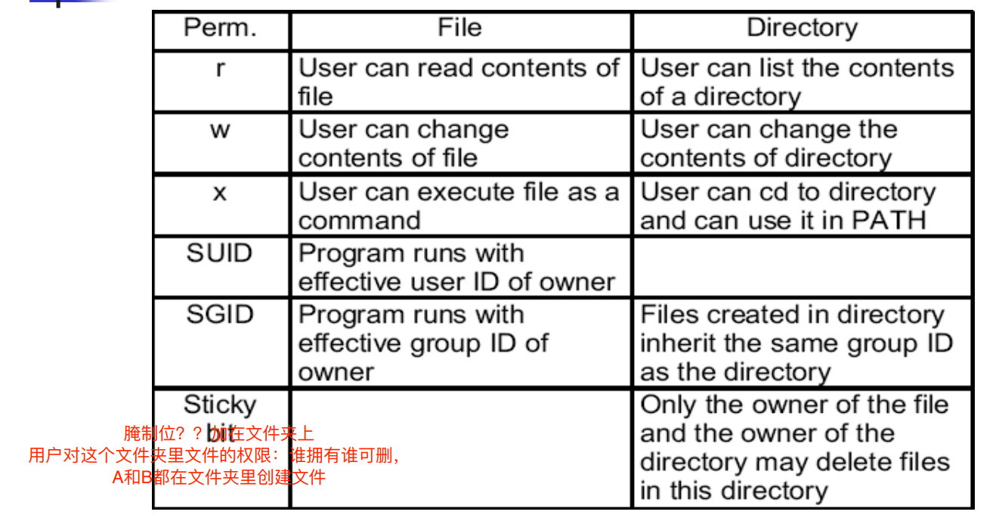

#### 10.4.7.12. Deep into SUID, SGID, Sticky bit
1. 用来提高权限，SUID将用户提升到root权限，SGID将group提升到root
2. Authorization in a Linux system is based on file permissions
3. An SUID or SGID bit on a program elevates your authorization level while running that program to the authorization level of the owner of that program
4. Typical SUID/SGID programs are su and sudo

#### 10.4.7.13. File permission(第一个0表示八进制)
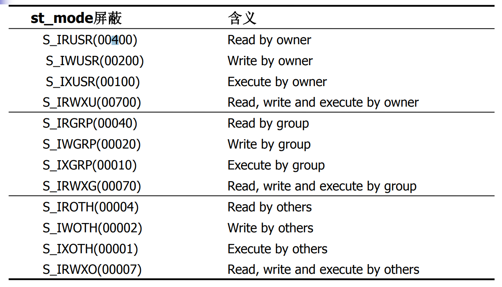


#### 10.4.7.14. 获取权限
1. 按**实际用户ID和实际组ID**测试文件存取权限

```c++
#include <unistd.h>
int access(const char *pathname, int mode);
// (Return: 0 if success; -1 if failure)
```

2. Parameter‏"mode"：R_OK(可读), W_OK(可写), X_OK(可执行), F_OK(可见)

#### 10.4.7.15. chmod/fchmod functions
1. Change permissions of a file

```c++
#include <sys/types.h>
#include <sys/stat.h>
int chmod(const char *path, mode_t mode);
int fchmod(int fildes, mode_t mode);
// (Return: 0 if success; -1 if failure)
```

#### 10.4.7.16. chown/fchown/lchown functions
1. Change ownership of a file

```c++
#include <sys/types.h>
#include <unistd.h>
int chown(const char *path, uid_t owner, gid_t group);
int fchown(int fd, uid_t owner, gid_t group);
int lchown(const char *path, uid_t owner, gid_t group); // 修改软链接
// (Return: 0 if success; -1 if failure)
```

#### 10.4.7.17. umask function
1. 为进程设置文件存取权限屏蔽字，并返回以前的值

```c++
#include <sys/types.h>
#include <sys/stat.h>
mode_t umask(mode_t mask);
```

#### 10.4.7.18. link/unlink functions
1. Create a new link to (make a new name for) a file.
```c++
#include <unistd.h>
int link(const char *oldpath, const char *newpath);// newpath是软连接文件名
// (Return: 0 if success; -1 if failure)
```

2. Delete a name and possibly the file it refers to.

```c++
#include <unistd.h>
int unlink(const char *pathname);
// (Return: 0 if success; -1 if failure)
```

#### 10.4.7.19. symlink/readlink
1. Create a symbolic link (named newpath which contains‏ the ‏string‏ "oldpath")
```c++
#include <unistd.h>
int symlink(const char *oldpath, const char *newpath);
// (Return: 0 if success; -1 if failure)
```

2. Read value of a symbolic link

```c++
#include <unistd.h>
int readlink(const char *path, char *buf, size_t bufsiz);
// (Return: the count of characters placed in the buffer if success; -1 if failure)
```

#### 10.4.7.20. Handling directories
1. mkdir/rmdir
2. chdir/fchdir, getcwd
3. Read a directory:一些系统调用和命令行命令并不重名
   1. opendir/closedir
   2. readdir
   3. telldir
   4. seekdir

#### 10.4.7.21. mkdir/rmdir functions
1. 创建一个空目录

```c++
#include <sys/stat.h>
#include <sys/types.h>
int mkdir(const char *pathname, mode_t mode);
// (Return: 0 if success; -1 if failure)
```

2. 删除一个空目录

```c++
#include <unistd.h>
int rmdir(const char *pathname);
// (Return: 0 if success; -1 if failure)
```

#### 10.4.7.22. chdir/fchdir functions
1. Change working directory

```c++
#include <unistd.h>
int chdir(const char *path);
int fchdir(int fd);
// (Return: 0 if success; -1 if failure)
```

2. 当前工作目录是进程的属性，所以该函数只影响调用 chdir的进程本身:`cd(1) command`

#### 10.4.7.23. getcwd function
1. 获得当前工作目录的绝对路径

```c++
#include <unistd.h>
char *getcwd(char *buf, size_t size);
// (返回值: 若成功则为buf，若出错则为NULL)
```

#### 10.4.7.24. Read a directory
1. Data structures
   1. DIR(类型别名), struct dirent
2. Operations
   1. opendir/closedir
   2. readdir
   3. telldir
   4. seekdir

#### 10.4.7.25. Data structures
1. DIR
   1. The data type of directory stream objects
   2. in `<dirent.h>`
      1. typedef struct __dirstream DIR;
2. struct dirent
   1. Directory item
   2. Defined in `<dirent.h>`

```c++
ino_t d_ino; /* inode number */
char d_name[NAME_MAX + 1]; /* file name */
```

#### 10.4.7.26. Operations
1. 目录的打开、关闭、读、定位

```c++
#include <sys/types.h>
#include <dirent.h>
DIR *opendir(const char *name);
int closedir(DIR *dir);
struct dirent *readdir(DIR *dir);
off_t telldir(DIR *dir);// 查看当前目录项的偏移量
void seekdir(DIR *dir, off_t offset); // 跳转至下一个目录项，可指定偏移量
```

#### 10.4.7.27. 一个目录扫描程序
```c++
DIR *dp;
struct dirent *entry;
if ( (dp = opendir(dir)) == NULL )
   err_sys(…);
while ( (entry = readdir(dp)) != NULL ) {
   lstat(entry->d_name, &statbuf);
   if ( S_ISDIR(statbuf.st_mode) )
   …
   else
   …
}
closedir(dp);
```

## 10.5. File lock
1. 锁起的作用
    1. 几个进程同时操作一个文件
    2. 比如多个记事本同时编辑一个文件
2. 锁放在哪里
   1. 理论
   2. 实践

### 10.5.1. 文件锁分类
1. 记录锁
2. 劝告锁
   1. 检查，加锁有应用程序自己控制
3. 强制锁
   1. 检查，加锁由内核控制
   2. 影响[open() read() write()]等
4. 共享锁：读锁
5. 排他锁：写锁

### 10.5.2. 特殊类型
1. 共享模式强制锁：锁上加一些规则，什么规则可以做，什么规则不可以做
2. 租借锁

### 10.5.3. 标志位
1. mount -o mand /dev/sdb7 /mnt
2. super_block
   1. s_flags
3. MS_MANDLOCK
4. 不是所有文件系统都可以对文件加锁！

### 10.5.4. fcntl记录锁
1. 用于记录锁的fcntl函数原型

```c++
#include <unistd.h>
#include <fcntl.h>
int fcntl(int fd, int cmd, struct flock *lock);
//(返回值: 若成功则依赖于cmd，若出错为-1)
```

### 10.5.5. struct flock
```c++
struct flock{
   ...
   short l_type; /* Type of lock: F_RDLCK, F_WRLCK, F_UNLCK */
   short l_whence; /* How to interpret l_start: SEEK_SET, SEEK_CUR,
   SEEK_END */
   off_t l_start; /* Starting offset for lock */
   off_t l_len; /* Number of bytes to lock */
   pid_t l_pid; /* PID of process blocking our lock (F_GETLK only) */
   // 获得当前文件被加锁的进程ID号，只有在F_GETLK时才用
   ...
}
```

### 10.5.6. cmd参数
1. cmd参数的取值
   1. F_GETLK：获得文件的封锁信息
   2. F_SETLK：对文件的某个区域封锁或解除封锁
   3. F_SETLKW：功能同F_SETLK, wait方式

### 10.5.7. 其它封锁命令
1. lockf函数

```c++
#include <sys/file.h>
int lockf(int fd, int cmd, off_t len);
// 怎么加锁就要怎么解锁！cmd 可以是F_ULOCK、F_LOCK、F_TLOCK(相当于fcntl的setlkw，等等！)
```