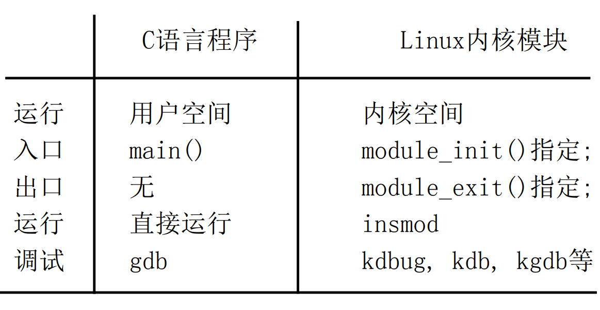

Lec4-Kernel Driver
---

# 1. Linux内核简介
1. 什么是内核
   1. 操作系统是一系列程序的集合，其中最重要的部分构成了内核
   2. 单内核/微内核
      1. 单内核是一个很大的进程，内部可以分为若干模块，运行时是一个独立的二进制文件，模块间通讯通过直接调用函数实现
      2. 微内核中大部分内核作为独立的进程在特权下运行，通过消息传递进行通讯
   3. Linux内核的能力
      1. 内存管理，文件系统，进程管理，多线程支持，抢占式，多处理支持
   4. Linux内核区别于其他UNIX商业内核的优点
      1. 单内核，模块支持
      2. 免费/开源
      3. 支持多种CPU，硬件支持能力非常强大
      4. Linux开发者都是非常出色的程序员
      5. 通过学习Linux内核的源码可以了解现代操作系统的实现原理

# 2. 层次结构


# 3. 内核源代码获取
1. https://www.kernel.org/
2. apt-get方式
   1. apt-cache search linux-source //查看内核版本
   2. apt-get install linux-source-3.2
   3. 下载下来的位置一般在/usr/src
3. 从Ubuntu的源码库中获得内核源码
   1. git clone git://kernel.ubuntu.com/ubuntu/ubuntuhardy.git

## 3.1. 后续操作
1. 解压：tar jxvf /home/ldd/linux-3.2.tar.bz2
2. 清除先前编译产生的目标文件：make clean
3. 配置内核：make menuconfig

## 3.2. 编译选项
1. 内核组件
   1. Y(*) 要集成该组件
   2. N() 不需要该组件，以后会没有这项功能
   3. M 以后再加该组件为一个外部模块

## 3.3. 编译内核
1. make
2. make zImage
3. make bzImage
4. make modules

## 3.4. 启用新内核
1. make install(慎用)
   1. 将编译好的内核copy到/boot
2. 配置引导菜单

## 3.5. 初始化程序的建立
1. initrd
   1. mkinitrd /boot/initrd.img $(uname -r)
2. initramfs
   1. mkinitramfs -o /boot/initrd.img 2.6.24-16
   2. update-initramfs -u

## 3.6. Debian和Ubuntu的简便办法
1. make-kpkg
   1. 用于make menuconfig之后
2. 好处
   1. 后面所有的部分自动做完
   2. 会把编译好的内核打成deb安装包
   3. 可以拷到其它机器安装

## 3.7. 驱动
1. 许多常见驱动的源代码集成在内核源码里
2. 也有第三方开发的驱动，可以单独编译成模块.ko
3. 编译需要内核头文件的支持

## 3.8. 加载模块
1. 底层命令
   1. insmod：加载模块
   2. rmmod：释放模块
2. 高层命令
   1. modprobe
   2. modprobe -r

## 3.9. 模块依赖
1. 一个**模块A引用另一个模块B**所导出的符号，我们就说**模块B被模块A引用**。
2. **如果要装载模块A，必须先要装载模块B**。否则，模块B所导出的那些符号的引用就不可能被链接到模块A中。这种模块间的相互关系就叫做**模块依赖**。

## 3.10. 模块的依赖
1. 自动按需加载
2. 自动按需卸载
3. moddep
4. lsmod
5. modinfo

## 3.11. 模块之间的通讯
1. 模块是为了完成某种特定任务而设计的。其功能比较的单一，为了丰富系统的功能，所以模块之间常常进行通信。其之间可以共享变量，数据结构，也可以调用对方提供的功能函数。

## 3.12. 模块相关命令
1. `insmod <module.ko> [module parameters]`
   1. Load the module
   2. 注意，只有超级用户才能使用这个命令
2. rmmod
   1. Unload the module
3. lsmod
   1. List all modules loaded into the kernel
   2. 这个命令和cat /proc/modules等价
4. `modprobe [-r] <module name>`：这个文件是个假文件，如果打印出来，得到的是当前内核加载的模块列表，不可修改、不可删除。
   1. Load the module specified and modules it depends

## 3.13. Linux内核模块与应用程序的区别


## 注意点
1. 不可以使用C库来开发驱动程序
2. 没有内存保护机制
3. 小内核栈
4. 并发上的考虑

# 最简单的内核模块例子
```c
#include <linux/kernel.h>
#include <linux/module.h>
#include <linux/init.h>
static int __init hello_init(void)
{
  printk(KERN_INFO "Hello world\n");
  return 0;
}
static void __exit hello_exit(void)
{
  printk(KERN_INFO "Goodbye world\n");
}
module_init(hello_init);
module_exit(hello_exit);
```

1. static int __init hello_init(void)
2. static void __exit hello_exit(void)
   1. Static声明，因为这种函数在特定文件之外没有其它意义
   2. __init标记, 该函数只在初始化期间使用。模块装载后，将该函数占用的内存空间释放
   3. __exit标记 该代码仅用于模块卸载。
3. Init/exit
   1. 宏：module_init/module_exit
   2. 声明模块初始化及清除函数所在的位置
   3. 装载和卸载模块时，内核可以自动找到相应的函数
      1. module_init(hello_init);
      2. module_exit(hello_exit);

## 编译内核模块
1. Makefile文件

```makefile
obj-m := hello.o
all:
  make -C /lib/modules/$(shell uname -r)/build M=$(shell pwd) modules
clean:
  make -C /lib/modules/$(shell uname -r)/build M=$(shell pwd) clean
```

2. Module includes more files

```makefile
obj-m:=hello.o
hello-objs := a.o b.o
```

## 和硬件打交道
```c
//file name: ioremap_driver.c
#include<linux/module.h>
#include<linux/init.h>
#include<asm/io.h>
//用于存放虚拟地址和物理地址
volatile unsigned long virt,phys;
//用与存放三个寄存器的地址
volatile unsigned long*GPBCON,*GPBDAT,*GPBUP;
void led_device_init(void){
  //0x56000010+0x10 包揽全所有的IO引脚寄存器地址
  phys=0x56000010;
  //0x56000010=GPBCON
  //在虚拟地址空间中申请一块长度为0x10的连续空间
  //这样，物理地址phys到phys+0x10对应虚拟地址virt到virt+0x10
  virt=(unsigned long)ioremap(phys,0x10);
}
void led_device_init(void)
{
  // 0x56000010 + 0x10 包揽全所有的IO引脚寄存
  器地址
  phys=0x56000010 ;
  // 0x56000010=GPBCON
  //在虚拟地址空间中申请一块长度为0x10的连续空间
  //这样，物理地址phys到phys+0x10对应虚拟地址
  virt到virt+0x10
  virt=(unsigned long)ioremap(phys,0x10);
  GPBCON=(unsigned long*)(virt+0x00);
  //指定需要操作的三个寄存器的地址
  GPBDAT=(unsigned long*)(virt+0x04);
  GPBUP=(unsigned long*)(virt+0x08);
}
//led配置函数,配置开发板的GPIO的寄存器
void led_configure(void)
{
*GPBCON&=~(3<<10)&~(3<<12)&~(3<<16)&~(3<<20);
}
//led配置函数,配置开发板的GPIO的寄存器
void led_configure(void)
{
  *GPBCON&=~(3<<10)&~(3<<12)&~(3<<16)&~(3<<20);
  //GPB12 defaule 清零
  *GPBCON|=(1<<10)|(1<<12)|(1<<16)|(1<<20);
  //output 输出模式
  *GPBUP|=(1<<5)|(1<<6)|(1<<8)|(1<<10);
  //禁止上拉电阻
}
//点亮led
void led_on(void)
{
  *GPBDAT&=~(1<<5)&~(1<<6)&~(1<<8)&~(1<<10);
}
//灭掉led
void led_off(void)
{
  *GPBDAT&=~(1<<5)&~(1<<6)&~(1<<8)&~(1<<10);
}
//灭掉led
void led_off(void)
{
  *GPBDAT|=(1<<5)|(1<<6)|(1<<8)|(1<<10);
}
//模块初始化函数
static int __init led_init(void)
{
  led_device_init();
  //实现IO内存的映射
  led_configure();
  //配置GPB5 6 8 10为输出
  led_on();
  printk("hello ON!\n");
  return 0 ;
}
//模块卸载函数
static void __exit led_exit(void)
{
  led_on();
  printk("hello ON!\n");
  return 0 ;
}
//模块卸载函数
static void __exit led_exit(void)
{
  led_off();
  iounmap((void*)virt);
  //撤销映射关系
  printk("led OFF!\n");
}
module_init(led_init);
module_exit(led_exit);
MODULE_LICENSE("GPL");
MODULE_AUTHOR("hurryliu<>");
MODULE_VERSION(“2012-8-5.1.0”);
```